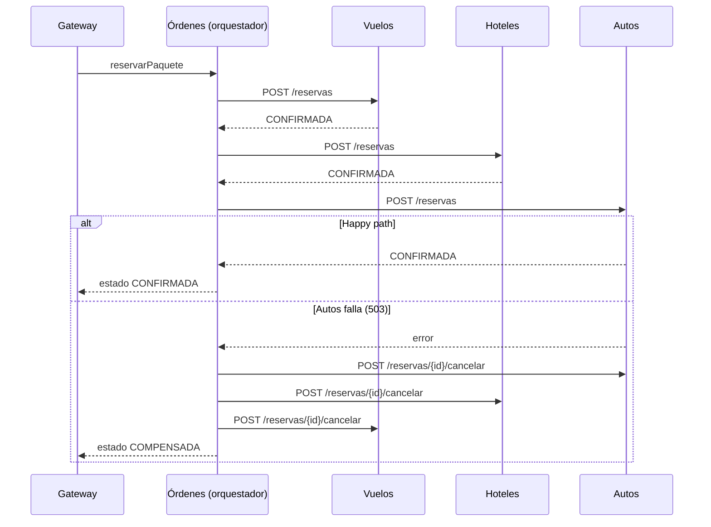

# WanderSync Travel Solutions

Plataforma de paquetes turísticos (vuelo + hotel + auto) construida con microservicios.
Parcial del segundo corte de **Patrones Arquitectónicos Avanzados**.

Tecnologías obligatorias: **Docker Compose, GraphQL, patrón SAGA, Dask y Prefect**.
Stack elegido: **Python** (FastAPI + Strawberry GraphQL + PostgreSQL).

---

## Índice

1. [Cómo ejecutarlo](#1-cómo-ejecutarlo)
2. [Arquitectura](#2-arquitectura)
3. [Estructura del repositorio](#3-estructura-del-repositorio)
4. [Paso a paso: qué se ha construido](#4-paso-a-paso-qué-se-ha-construido)
5. [Cómo probarlo (GraphiQL)](#5-cómo-probarlo-graphiql)
6. [Demo del fallo y las compensaciones SAGA](#6-demo-del-fallo-y-las-compensaciones-saga)
   - [6b. Demo de Prefect + Dask](#6b-demo-de-prefect--dask)
   - [6c. Demo de seguridad](#6c-demo-de-seguridad)
7. [Avance del proyecto](#7-avance-del-proyecto)
8. [Problemas comunes](#8-problemas-comunes)

---

## 1. Cómo ejecutarlo

Requisito: tener **Docker Desktop** abierto.

```bash
docker compose up --build
```

La primera vez tarda varios minutos (instala Prefect y Dask). Cuando todo esté arriba, abre:

| URL | Qué es |
|---|---|
| **http://localhost:3000** | **Frontend** (React): crear cuenta o iniciar sesión, buscar paquetes y reservar (`/?demo` muestra los paneles técnicos) |
| **http://localhost:8000/graphql** | Editor GraphiQL del API Gateway |
| **http://localhost:4200** | Panel de Prefect (flows, tareas, reintentos, logs) |
| **http://localhost:8787** | Panel de Dask (workers y tareas en ejecución) |

> Docker necesita espacio en disco: deja al menos **5 GB libres**. Si el disco se llena, Docker Desktop se cuelga y hay que reiniciarlo.

Para apagar todo **y borrar la base de datos** (necesario si se modifica `db/init.sql`):

```bash
docker compose down -v
```

### URL pública (Cloudflare Tunnel)

Para abrir la app desde cualquier lugar con una URL `https://` propia, sin tocar el router ni crear cuentas:

```bash
docker compose --profile publico up -d --build
docker compose logs tunel
```

En los logs aparece una línea como `https://palabras-al-azar.trycloudflare.com`: esa es la URL pública. Ábrela desde el celular o compártela.

- Solo se publica el **frontend**: Prefect, Dask, la BD y los microservicios siguen siendo privados.
- La URL funciona **mientras tu PC y Docker estén encendidos**, y **cambia cada vez que el túnel se reinicia**.
- Seguridad: nginx toma la IP real del visitante (`CF-Connecting-IP`) para el rate limiting, y el Gateway marca la cookie de sesión como `Secure` cuando la petición llegó por HTTPS.
- En la URL pública, los enlaces de modo demo a Prefect y Dask no funcionan (esos paneles solo existen en tu PC): úsalos desde `localhost`.
- Para apagar solo el túnel: `docker compose stop tunel`.

**Plan B (sin construir la imagen del frontend):** con `npm run dev -- --host` corriendo en `frontend/`, publica el servidor de desarrollo:

```bash
set TUNEL_DESTINO=http://host.docker.internal:5173
docker compose --profile publico up -d tunel
```

---

## 2. Arquitectura

```
   Navegador ──► Frontend :3000 (nginx) ──/graphql──►┌──────────────────────────────┐
                                                     │  Gateway GraphQL  :8000      │  ← única puerta de entrada al backend
                                                     └──────┬───────────────┬───────┘
                                             consultas      │               │  mutation reservarPaquete
                                        (en paralelo)       ▼               ▼
                                   ┌────────┬─────────┬────────┐  ┌──────────────────────┐
                                   │ Vuelos │ Hoteles │ Autos  │◄─┤ Órdenes (orquestador │
                                   └───┬────┴────┬────┴───┬────┘  │ de la SAGA)          │
                                       │         │        │       └──────────┬───────────┘
                                       ▼         ▼        ▼                  ▼
                                   ┌──────────────── PostgreSQL ──────────────────────┐
                                   │  BD vuelos │ BD hoteles │ BD autos │ BD ordenes  │   ← una base de datos por servicio
                                   └──────────────────────────────────────────────────┘
                                                           ▲ UPSERT en lote (tabla hoteles)
                                                           │
                              Prefect Flow ──► Dask scheduler ──► Dask workers (x2) ──► descargar → estructurar → limpiar → guardar
                              (cada 30 min,                                                  │
                               retries, panel :4200)                                         ▼
                                                                                Hostelworld.com (sitio comercial real)
                                                                                + Trivago.com.co (páginas de destino)
```

### Decisiones de diseño (y por qué)

| Decisión | Justificación |
|---|---|
| **Una base de datos por microservicio** | Cada servicio es dueño de sus datos; ninguno puede hacer JOIN ni transacciones sobre los datos de otro. Esto es lo que hace **necesario** el patrón SAGA: no existe un `COMMIT` que abarque varios servicios. |
| **SAGA por orquestación** (no coreografía) | Toda la lógica del flujo vive en un solo lugar (servicio Órdenes): más fácil de entender, depurar, demostrar y dibujar. No requiere broker de mensajes. |
| **Compensaciones en orden inverso** | Se deshace lo último primero, porque los pasos posteriores pueden depender de los anteriores. |
| **Idempotencia con `saga_id`** | El `saga_id` es llave primaria en cada tabla `reservas`. Reintentar una reserva o una cancelación nunca duplica nada (`ON CONFLICT DO NOTHING`). Esto hace seguro reintentar. |
| **Las compensaciones se reintentan** (backoff 1s, 2s, 4s, 8s, 16s) | Una compensación no puede rendirse. Si agota los reintentos, la SAGA queda en `REQUIERE_ATENCION` (nunca falla en silencio). |
| **Cancelar = cambiar estado, no borrar** | Queda trazabilidad de lo que pasó. |
| **Tabla `sagas` como bitácora** | Se actualiza en cada paso: sirve de evidencia y permitiría retomar una SAGA si el orquestador se cae. |
| **`NUMERIC` para precios, no `FLOAT`** | `FLOAT` redondea en binario (`0.1 + 0.2 = 0.30000000000000004`); con dinero eso descuadra cuentas. |
| **Solo el Gateway y el frontend exponen puerto** | Los microservicios (Vuelos, Hoteles, Autos, Órdenes) solo son accesibles dentro de la red de Docker: nadie puede saltarse el Gateway. El 8000 queda abierto para la demo con GraphiQL. |
| **El frontend llega al Gateway por un proxy (nginx)** | El navegador ve un solo origen (`localhost:3000`) para la página y para `/graphql`: la cookie `SameSite=Strict` funciona sin abrir CORS. |
| **Credenciales por variables de entorno** | La URL de la BD no está escrita en el código. |
| **Seguridad centralizada en el Gateway** | Es la única puerta de entrada: autenticación, sesiones y rate limiting se aplican en un solo lugar y nada puede saltárselos. |

---

## 3. Estructura del repositorio

```
├── docker-compose.yml   # Define y conecta todos los contenedores
├── db/
│   └── init.sql         # Crea las 4 bases de datos, tablas y datos de prueba
├── vuelos/              # Microservicio de Vuelos   (FastAPI)
├── hoteles/             # Microservicio de Hoteles  (FastAPI)
├── autos/               # Microservicio de Autos    (FastAPI) + interruptor de fallo
├── ordenes/             # Microservicio de Órdenes  = orquestador SAGA
├── ofertas/             # Microservicio de Ofertas  (ofertas de Booking por categoría)
├── gateway/             # API Gateway GraphQL (Strawberry) + seguridad.py
├── ingesta/             # Scraper + Prefect Flow + Dask (una imagen para 4 contenedores)
├── frontend/            # React + Vite + Tailwind, servido por nginx (proxy de /graphql)
├── docs/                # Documento técnico de arquitectura
└── seguridad/           # Scripts y reportes de auditoría de dependencias (pip-audit y npm audit)
```

Cada carpeta de servicio tiene:

- `Dockerfile`: cómo se construye la imagen del contenedor.
- `requirements.txt`: dependencias de Python.
- `main.py`: el código del servicio (comentado línea por línea).

---

## 4. Paso a paso: qué se ha construido

### Paso 1 — Docker Compose + primer microservicio (Vuelos)

- `vuelos/Dockerfile` construye una imagen con Python 3.12 y arranca el servidor con `uvicorn`.
- `docker-compose.yml` levanta **PostgreSQL** y **Vuelos**.
- Puntos clave:
  - Dentro de Compose los servicios se encuentran por **nombre** (`db`, `vuelos`...), no por `localhost`.
  - `depends_on: condition: service_healthy` hace que los servicios esperen a que Postgres esté listo. Sin esto arrancan antes que la BD y fallan.

### Paso 2 — Base de datos inicial

- `db/init.sql` se monta en `/docker-entrypoint-initdb.d/`. Postgres lo ejecuta **solo la primera vez** que crea la BD.
- Crea una base de datos por servicio (`vuelos`, `hoteles`, `autos`, `ordenes`) con sus tablas y datos de prueba.

### Paso 3 — Microservicios Hoteles y Autos

Los tres servicios (Vuelos, Hoteles, Autos) tienen la misma forma:

| Endpoint | Para qué |
|---|---|
| `GET /vuelos` · `/hoteles` · `/autos` | Listar (con filtro opcional `?destino=` / `?ciudad=`) |
| `GET /vuelos/{id}` · `/hoteles/{id}` · `/autos/{id}` | Una pieza por id: el Gateway la usa al reservar para validar el paquete y calcular el precio |
| `GET /destinos` (Vuelos) · `GET /ciudades` (Hoteles) | Ciudades con vuelo / con alojamiento: el Gateway las cruza para saber qué destinos tienen paquetes |
| `POST /reservas` | **Acción** de la SAGA: reserva → estado `CONFIRMADA` |
| `POST /reservas/{saga_id}/cancelar` | **Compensación** de la SAGA: estado → `CANCELADA` |
| `GET /health` | Comprobar que el servicio está vivo |

Autos además tiene el interruptor `FORZAR_FALLO_AUTOS` para simular una caída (ver sección 6).

Vuelos, Autos y Órdenes **migran su esquema al arrancar** (`ALTER TABLE … ADD COLUMN IF NOT EXISTS`, índices `IF NOT EXISTS`): `db/init.sql` solo corre al crear el volumen, así que una BD creada antes recibe las columnas nuevas sin borrar nada.

#### Destinos

La página de Booking "Vuelos desde Bogotá" trae **50 destinos** (Colombia, Latinoamérica, Norteamérica y Europa). Un destino tiene **paquete** cuando además hay alojamiento: el flow descarga Hostelworld para **30 de ellos** (14 en Colombia, 10 en América y 6 en Europa; la lista y sus rutas están en `CIUDADES` de `ingesta/flow.py`). Los demás destinos se pueden buscar igual y muestran sus ofertas de Booking. De dónde sale cada pieza:

| Pieza | Fuente | Cómo llega |
|---|---|---|
| Alojamiento | Hostelworld en vivo (30 ciudades) + Trivago (MDE, CTG, SMR) | tareas `descargar` / `descargar_trivago` del flow |
| Vuelo BOG → destino | Página "Vuelos desde Bogotá" de Booking (precio por persona) | tarea `guardar_catalogo` → BD `vuelos`, `fuente = 'booking-muestra'` |
| Auto | Precio medio de alquiler por día de Booking | tarea `guardar_catalogo` → BD `autos`, modelo "Auto estándar · precio medio en Booking" |

Donde Booking no tiene alquiler de autos (por ejemplo Pereira, San Andrés, Cancún o Lima), el paquete es **vuelo + hotel** (`auto: null`) y la SAGA solo tiene dos pasos. Cúcuta, Montería o Valledupar tienen vuelo pero no alojamientos en Hostelworld, así que solo tienen ofertas. La query `destinos` devuelve las ciudades que **hoy** tienen vuelo y alojamiento, con nombre, país y vuelo más barato.

### Paso 4 — Orquestador SAGA (servicio Órdenes)

`ordenes/main.py` → `POST /ordenes`:

1. Crea un `saga_id` único y lo registra en la tabla `sagas` con estado `EN_CURSO`.
2. Llama **en orden**: Vuelos → Hoteles → Autos.
3. **Si todo sale bien** → `CONFIRMADA`.
4. **Si un paso falla** → `COMPENSANDO`: cancela en **orden inverso** todo lo que se intentó (incluido el paso que falló, por si alcanzó a reservar antes de un timeout; como cancelar es idempotente, es inofensivo) → `COMPENSADA`.
5. Si alguna cancelación agota sus reintentos → `REQUIERE_ATENCION`.

Cada SAGA guarda **de quién es** (`usuario_id`) y un resumen de lo reservado (destino, vuelo, hotel, auto, noches, personas, total), que le manda el Gateway: Órdenes no puede leer las BD de los otros servicios.

**Mis reservas y cancelación:**

| Endpoint | Qué hace |
|---|---|
| `GET /ordenes?usuario_id=N` | Reservas del usuario, la más reciente primero |
| `GET /ordenes/{id}?usuario_id=N` | Una reserva; si no es de ese usuario responde 404, igual que si no existiera |
| `POST /ordenes/{id}/cancelar` | Cancela una reserva `CONFIRMADA`: pasa **atómicamente** a `CANCELANDO` (un `UPDATE … WHERE estado = 'CONFIRMADA'`, así dos clics no cancelan dos veces) y ejecuta las **mismas compensaciones** de la SAGA en orden inverso (auto → hotel → vuelo) → `CANCELADA`, o `REQUIERE_ATENCION` si alguna no se pudo. Otro estado → 409 |



### Paso 5 — API Gateway GraphQL

`gateway/main.py` (Strawberry + FastAPI) expone en `/graphql`:

| Operación | Tipo | Qué hace |
|---|---|---|
| `paquetes(destino, noches, personas)` | Query | Consulta Vuelos, Hoteles y Autos **en paralelo** (`asyncio.gather`), combina y calcula `precioTotal`: vuelo × personas + (hotel × habitaciones + auto × autos) × noches, con 2 personas por habitación y 5 por auto |
| `destinos` | Query | Códigos de las ciudades con paquetes hoy (vuelo **y** alojamiento) |
| `orden(sagaId)` | Query | Estado y resumen de una reserva **propia** (requiere sesión) |
| `misReservas` | Query | Reservas del usuario de la sesión (requiere sesión) |
| `ofertas(categoria)` | Query | Ofertas de Booking (alojamiento, vuelos, coches, atracciones) desde el servicio Ofertas |
| `reservarPaquete(vueloId, hotelId, autoId?, personas, noches)` | Mutation | Dispara la SAGA en Órdenes (**requiere sesión**). El Gateway pide vuelo, hotel y auto por id, comprueba que sean del mismo destino y **calcula el total en el servidor**: el navegador nunca manda precios |
| `cancelarReserva(sagaId)` | Mutation | Cancela una reserva propia confirmada (**requiere sesión**, 10/minuto por IP) |
| `registrar`, `iniciarSesion`, `cerrarSesion`, `yo` | Mutation / Query | Autenticación (ver Paso 7) |

**¿Cómo se elimina el over-fetching?** En REST el servidor decide qué campos devuelve. En GraphQL **el cliente pide exactamente los campos que necesita** y recibe solo esos, en una única petición. Además, cada microservicio filtra por ciudad en su propia BD, así que entre servicios tampoco viajan datos innecesarios.

### Paso 6 — Scraping real + Dask + Prefect

`ingesta/flow.py` define un **Flow de Prefect** con 4 tareas por ciudad (las 30 de Hostelworld), ejecutadas **en paralelo en 2 workers de Dask**:

| Tarea | Qué hace | Reintentos |
|---|---|---|
| `descargar` | Lee `robots.txt`, verifica permiso y descarga la página de hostales de la ciudad | 3 (5s, 15s, 45s) |
| `estructurar` | Extrae nombre, precio y rating de cada tarjeta HTML (BeautifulSoup) | — |
| `limpiar` | Convierte textos a números (`"CO$58,349.63"` → `58349.63`), descarta precios inválidos | — |
| `guardar` | UPSERT en lote en la BD de hoteles (una conexión y una transacción por ciudad) | 2 |

- **Dask** reparte las tareas entre los workers (`.map()` lanza una tarea por ciudad). Prefect usa `DaskTaskRunner` para enviarlas al clúster.
- **Prefect** registra el flow (`serve`), lo programa **cada 30 minutos** y muestra en su panel el estado, la duración, los logs y los reintentos de cada tarea.
- **Persistencia sin cuellos de botella:** se guarda en lote (`executemany`) con `ON CONFLICT (url) DO UPDATE`, así re-scrapear actualiza precios en vez de duplicar hoteles.
- Los hostales reales aparecen en GraphQL con `fuente: "hostelworld"`, junto a los datos `semilla`.

#### Fuente de datos y scraping responsable

| Sitio | Resultado de la evaluación |
|---|---|
| Booking.com | Responde con un **desafío anti-bot (AWS WAF)**. Descartado: evadirlo no es aceptable. |
| Kayak | Su `robots.txt` prohíbe `/flights/`, `/hotels/`, `/cars/`. Descartado. |
| Despegar | Responde **403** (bloqueo anti-bot). Descartado. |
| **Trivago** | Su `robots.txt` prohíbe `/*/srl/` (resultados de búsqueda) y `/hotel/`, pero **permite las páginas de destino** `/es-CO/odr/...`, que traen los hoteles en el HTML del servidor. **Elegido como segunda fuente** (ver abajo). |
| **Hostelworld** | `robots.txt` **permite** `/hostels/...` y la página llega completa. **Elegido.** |

Buenas prácticas aplicadas:

- Se respeta `robots.txt` usando **`protego`** (cumple el estándar RFC 9309). No se usa `urllib.robotparser`, de la librería estándar, porque interpreta mal reglas como `Disallow: /s?` y bloquea rutas permitidas.
- `User-Agent` honesto que identifica al bot del proyecto. No se disfraza de navegador.
- Una petición por ciudad por ejecución.
- Si el sitio responde con un desafío anti-bot, la tarea **falla**. No se intenta evadirlo.

#### Fuente 2: Trivago (BeautifulSoup): descarga en vivo con respaldo de páginas guardadas

> **Resultado real (6 de octubre de 2026):** Trivago respondió **HTTP 403 con desafío anti-bot** a las tres páginas de destino. El flow lo detecta, **no reintenta ni lo evade**, y procesa en su lugar las páginas guardadas desde el navegador: **34** alojamientos en Medellín, **32** en Cartagena y **34** en Santa Marta (`fuente: "trivago-muestra"`). Si algún día Trivago deja pasar al bot, el mismo código toma los datos en vivo (`fuente: "trivago"`) sin cambiar nada.

Se descargan las **páginas de destino** de Trivago (`/es-CO/odr/hoteles-<ciudad>?search=200-<id>`), que su `robots.txt` **permite**: prohíbe `/*/srl/` (resultados de búsqueda), `/hotel/` y las imágenes, pero no `/es-CO/odr/`. Además, estas páginas aparecen en su sitemap de destinos, es decir, Trivago quiere que se indexen.

| Ciudad | Página de destino |
|---|---|
| MDE | `/es-CO/odr/hoteles-medellín-colombia?search=200-65524` |
| CTG | `/es-CO/odr/hoteles-cartagena-colombia?search=200-65529` |
| SMR | `/es-CO/odr/hoteles-santa-marta-colombia?search=200-65542` |

- **¿Por qué BeautifulSoup y no Selenium?** Estas páginas llegan con los hoteles ya escritos en el HTML del servidor, así que no hace falta ejecutar JavaScript ni abrir un navegador: `httpx` descarga y BeautifulSoup parsea. BeautifulSoup es un parser y no sirve para "esquivar" bloqueos, porque eso depende de la petición HTTP, no del parser.
- **Selectores estables** (`ingesta/trivago.py`), nunca las clases CSS ofuscadas que Trivago regenera en cada despliegue: (1) microdatos de schema.org (`itemtype=".../Hotel"`, `itemprop="name"`, `price`, `ratingValue`); (2) el enlace de cada hotel `/oar/...?search=100-<id>`: la tarjeta es el contenedor más pequeño que tiene precio sin incluir otro hotel; (3) bloques JSON-LD.
- Cada hotel puede traer varias ofertas de distintos partners: se guarda la **más barata**. Los precios en formato colombiano (`$ 1.024.473`, el punto separa miles) se normalizan antes de `limpiar`.
- Usa la misma descarga responsable que Hostelworld (`obtener_html`): `robots.txt` revisado en cada ejecución con `protego`, `User-Agent` honesto, una petición por ciudad.
- **Si Trivago bloquea al bot** (403, 429 o desafío anti-bot), la tarea falla **sin reintentar** (insistir sería ir contra la voluntad del sitio; un error de red sí se reintenta), y el flow usa como **respaldo** la página de esa ciudad guardada a mano en `ingesta/muestras/trivago/` (`fuente: "trivago-muestra"`). Instrucciones en [`LEEME.md`](ingesta/muestras/trivago/LEEME.md).
- Probar la descarga en vivo sin tocar la BD: `docker compose exec ingesta python trivago.py --probar`. Si encuentra 0 hoteles, guarda el HTML en `ingesta/muestras/diagnostico-<ciudad>.html` para revisar los selectores.

#### Fuente 3: ofertas de Booking.com (microservicio Ofertas)

Booking responde con un desafío anti-bot (AWS WAF, HTTP 202) **incluso a su `robots.txt`**. Según RFC 9309, si el robots.txt no se puede leer el bot debe asumir que no tiene permiso, así que **no se intenta ninguna descarga automática**: las ofertas salen de páginas guardadas desde el navegador (`ingesta/muestras/booking/`, ver su [`LEEME.md`](ingesta/muestras/booking/LEEME.md)).

- **Categorías:** alojamiento, vuelos, alquiler de coches y atracciones (una página por pestaña: `booking-<categoria>.html`). Cargadas hoy: **alojamiento** 11 destinos (campaña "Ahorra un 15% para finales de año"), **vuelos** 50 destinos desde Bogotá, **coches** 197 ciudades (precio medio por día) y **atracciones** 1.
- **Parser** (`ingesta/booking.py`), uno por categoría porque cada pestaña de Booking es una aplicación distinta. Nunca usa clases CSS ofuscadas:

  | Categoría | Dónde está cada oferta | Llave del UPSERT |
  |---|---|---|
  | Alojamiento | tarjetas `data-testid="card-deal"` (cantidad, destino, "Desde", precio, unidad) | `dest_id` del enlace |
  | Vuelos | el **estado inicial** de la aplicación (`window.__INITIAL_STATE__.flyAnywhere.results`): la página pinta 10 tarjetas pero trae los 50 destinos, con código IATA, país y precio por persona. Si no está, se leen las tarjetas `role="button"` *FlyAnywhere* | destino normalizado |
  | Coches | `data-testid="in-product-interlinking-item"` (ciudad, puntos de alquiler, precio medio al día) | ruta del enlace |
  | Atracciones | JSON de Apollo embebido (`script[data-capla-store-data="apollo"]`, objetos `AttractionsProduct`) | slug de la atracción |

  De los enlaces se descartan los parámetros de rastreo (`aid`, `label`). `guardar_ofertas` borra de cada categoría las ofertas que ya no están en la página guardada (en la misma transacción del UPSERT).
- **Scraping responsable con 30 ciudades:** el `robots.txt` de cada sitio se lee una vez por ejecución y por worker (caché de 30 minutos en `ingesta/robots_cache.py`), no una vez por ciudad. Va en un módulo aparte porque `flow.py` corre como `__main__` y una función con `@lru_cache` definida ahí no se puede enviar a Dask (el scheduler falla con "Error during deserialization of the task graph"). Y si Hostelworld mostrara un precio en otra moneda (€, US$), se descarta en vez de guardarlo como si fueran pesos.
- **Prefect + Dask:** `estructurar_booking` → `limpiar_ofertas` → `guardar_ofertas`, una cadena por categoría en paralelo en los workers. Es independiente de los hoteles: se procesa aunque Hostelworld y Trivago fallen, y si falla no tumba el flow.
- **Microservicio Ofertas** (`ofertas/`): dueño de la BD `ofertas` (*database per service*); al arrancar crea su BD y su tabla si no existen. El Gateway expone `ofertas(categoria)`.
- **Catálogo:** `guardar_catalogo` pasa los vuelos desde Bogotá y el precio medio de autos de los destinos del sistema a las BD de Vuelos y Autos (UPSERT por `(origen, destino, fuente)` y `(ciudad, modelo)`). Así las ofertas no son solo vitrina: alimentan paquetes reservables.
- **Frontend:** sección con pestañas bajo el buscador. Las ofertas de ciudades con paquetes llevan a esos paquetes ("Ver paquetes a…"); las demás, a Booking.

### Paso 7 — Ciberseguridad por diseño

Todo vive en `gateway/seguridad.py`, porque el Gateway es la única puerta de entrada. Usuarios y sesiones se guardan en su propia base de datos (`auth`).

#### Contraseñas con Argon2id

- Algoritmo **Argon2id**, el recomendado por OWASP, con costo alto: `time_cost=3`, `memory_cost=64 MiB`, `parallelism=4`. Cada hash consume 64 MiB de RAM, lo que hace carísima la fuerza bruta con GPUs si alguien roba la BD.
- **Sal aleatoria** por contraseña: dos usuarios con la misma clave tienen hashes distintos. En la BD se ve así: `$argon2id$v=19$m=65536,t=3,p=4$...`
- Longitud de **10 a 128 caracteres**. El tope evita que alguien sature la CPU enviando contraseñas gigantes.
- **Anti-enumeración:** si el email no existe, igual se verifica contra un hash de relleno, para que la respuesta tarde lo mismo. El mensaje de error siempre es genérico: `Credenciales inválidas`.
- El hashing corre en un hilo aparte (`asyncio.to_thread`) para no bloquear las demás peticiones.

#### Sesiones y mitigación de Session Fixation

- **Sesiones del lado del servidor.** El navegador solo guarda un token aleatorio de 256 bits (`secrets.token_urlsafe(32)`). En la BD se guarda su **SHA-256**, no el token, así que si roban la BD no obtienen sesiones utilizables.
- **Session Fixation:** en **cada login exitoso** se **borra** la sesión que traía el navegador (que podría haber plantado un atacante) y se emite un **ID nuevo**. El ID que conocía el atacante deja de servir.
- La cookie es `HttpOnly` (JavaScript no la puede leer, así que un XSS no la roba), `SameSite=Strict` (protege contra CSRF) y `Secure` en producción (`COOKIE_SECURE=true` con HTTPS). Expira en 1 hora.
- `cerrarSesion` borra la sesión en el servidor, no solo la cookie.

#### Rate Limiting

Como todo pasa por un único endpoint `/graphql`, el límite se aplica **por operación**. Se usa una ventana deslizante (`limits`, *moving window*). Al excederlo, la respuesta es **HTTP 429 Too Many Requests**.

| Operación | Límite | Protege contra |
|---|---|---|
| `iniciarSesion` | 5/minuto por IP **y** 10 cada 15 minutos por email | Fuerza bruta: un atacante probando muchas cuentas, o muchas IPs atacando una cuenta |
| `registrar` | 3/minuto por IP | Creación masiva de cuentas |
| `reservarPaquete` (checkout) | 10/minuto por IP | Abuso y DoS del checkout |
| `cancelarReserva` | 10/minuto por IP | Abuso de la cancelación |

#### Control de acceso a las reservas (IDOR)

Un `sagaId` es un UUID, pero no es un secreto: viaja en la interfaz y en los logs. Por eso **toda consulta o cancelación de una reserva exige sesión y filtra por el usuario de la sesión** (`usuario_id` lo pone el Gateway, nunca el cliente). La reserva de otra persona responde exactamente igual que una que no existe ("Reserva no encontrada"), así que ni siquiera se puede confirmar que existe. Y el total de la reserva lo calcula el Gateway con los precios de cada servicio: modificar la petición no cambia lo que se cobra.

> Limitación conocida: el contador vive en memoria, así que sirve para **una** réplica del Gateway. Con varias réplicas habría que pasar a Redis (`RedisStorage`).

#### Seguridad de la cadena de suministro (pip-audit)

`seguridad/auditar.sh` audita las dependencias de **cada** microservicio con `pip-audit` contra la base de vulnerabilidades de PyPI/OSV. Genera la evidencia formal en [`seguridad/auditoria-dependencias.md`](seguridad/auditoria-dependencias.md).

Último resultado: **0 vulnerabilidades conocidas en los 6 servicios.**

El frontend se audita con `npm audit` (`seguridad/auditar-frontend.sh` → [`seguridad/auditoria-frontend.md`](seguridad/auditoria-frontend.md)). Último resultado: **0 vulnerabilidades en 39 paquetes.**

```bash
docker run --rm -v "${PWD}:/w" -w /w node:22-alpine sh seguridad/auditar-frontend.sh
```

Para volver a ejecutarla (no requiere Python instalado):

```bash
docker run --rm -v "${PWD}:/w" -w /w python:3.12-slim sh seguridad/auditar.sh
```

> En Windows CMD, reemplaza `${PWD}` por `%cd%`.

### Paso 8 — Frontend

`frontend/` es una SPA en **React 19 + Vite + Tailwind**, compilada y servida por **nginx** (build multi-etapa: la imagen final no lleva Node ni el código fuente).

- **Solo habla con `/graphql`.** nginx reenvía esa ruta al Gateway; el frontend no conoce ningún microservicio.
- **Sin over-fetching:** cada consulta (`frontend/src/operaciones.js`) pide solo los campos que la pantalla muestra.
- **Pantalla de acceso primero:** sin sesión solo se ve la pantalla de inicio de sesión / registro (pestañas, mostrar contraseña, confirmación y validación en vivo). Si la sesión expira (1 hora) a mitad de una reserva, vuelve esa pantalla y, al entrar, la reserva se retoma.
- **Buscador:** botón **"Selecciona tu destino"** que abre todos los destinos de la página con un buscador por ciudad o país (primero los que tienen paquete, luego los que solo tienen ofertas de Booking; en celular es una hoja a pantalla completa). Debajo, **"Búsqueda por paquetes"** con un botón por cada destino con paquete. Si el destino no tiene paquete, la búsqueda muestra sus ofertas de Booking de todas las categorías.
- **Responsive** (probado en 360, 390, 768, 1024 y 1366 px, sin desplazamiento horizontal): en celular las ofertas son un carrusel que se desliza de lado, los destinos con paquete una fila deslizable, noches y personas van lado a lado, cada paquete muestra el hotel a lo ancho y vuelo + auto debajo, y al buscar la página baja a los resultados. El encabezado tiene un acceso directo a "Mis reservas".
- **Vista de cliente** (`http://localhost:3000`): buscar por destino, noches y **personas (1 a 9)**, reservar y ver el resultado en lenguaje de cliente (confirmada con código `WS-…`, o no completada porque todo se canceló solo). Sin paneles técnicos.
- **Mis reservas:** las reservas del usuario vienen del servidor (`misReservas`), así siguen ahí al recargar o desde otro equipo. Cada una muestra destino, hotel, noches, personas, total y estado, con **Actualizar estado** y **Cancelar reserva** (con confirmación) para las confirmadas.
- **Modo demo** (`http://localhost:3000/?demo`), para la sustentación: añade el **panel técnico de la SAGA** (pasos y compensaciones en orden inverso), el **Inspector GraphQL** (cada operación con su consulta exacta, bytes y tiempo), los enlaces a Prefect, Dask y GraphiQL y la etiqueta de origen de cada precio ("Hostelworld · en vivo", "Trivago · muestra").
- **Sesión segura:** el token vive en la cookie `HttpOnly`; JavaScript nunca lo lee ni lo guarda en `localStorage`.
- **Cabeceras de seguridad** en nginx: CSP solo `'self'` (las fuentes van empaquetadas, sin CDN), `X-Frame-Options: DENY`, `nosniff`, `Referrer-Policy`.
- **Rate limiting por IP real:** nginx envía `X-Real-IP` y el Gateway solo le cree si la petición viene del contenedor `frontend` (`PROXY_CONFIABLE`). Así cada usuario tiene su propio límite y nadie puede falsificar su IP llamando directo al puerto 8000.

Para desarrollar con recarga en caliente (con el resto del stack en Docker):

```bash
cd frontend
npm install
npm run dev     # http://localhost:5173 (Vite reenvía /graphql a localhost:8000)
```

---

## 5. Cómo probarlo (GraphiQL)

Abre **http://localhost:8000/graphql** y ejecuta:

**Consultar paquetes** (cambia los campos pedidos y observa cómo cambia la respuesta):

```graphql
{
  paquetes(destino: "MDE", noches: 3) {
    precioTotal
    hotel { nombre }
  }
}
```

Destinos: `MDE`, `CTG`, `SMR`, `CLO`, `BAQ`, `BGA`, `PEI`, `ADZ`, `MAD` (los que tienen datos los devuelve `{ destinos }`; los datos semilla solo cubren MDE, CTG y SMR, el resto llega con la primera ejecución del flow).

**Crear cuenta e iniciar sesión** (reservar requiere sesión; GraphiQL guarda la cookie automáticamente):

```graphql
mutation {
  registrar(email: "ana@test.co", password: "clave-super-segura") { id email }
}
```

```graphql
mutation {
  iniciarSesion(email: "ana@test.co", password: "clave-super-segura") { email }
}
```

**Reservar un paquete:**

```graphql
mutation {
  reservarPaquete(vueloId: 1, hotelId: 1, autoId: 1) {
    sagaId
    estado
  }
}
```

**Consultar una reserva:**

```graphql
{
  orden(sagaId: "PEGA-AQUI-EL-SAGA-ID") { estado paso }
}
```

---

## 6. Demo del fallo y las compensaciones SAGA

1. Crea un archivo `.env` en la raíz del repositorio con:

   ```
   FORZAR_FALLO_AUTOS=true
   ```

2. Reinicia solo el servicio de Autos:

   ```bash
   docker compose up -d autos
   ```

3. En **http://localhost:3000/?demo**, inicia sesión y reserva cualquier paquete → el cliente ve "No pudimos completar tu viaje" y el panel *Transacción SAGA* muestra `Compensada`: el auto falló y hotel y vuelo aparecen *Reservado → cancelado*, con las compensaciones en orden inverso. (También se puede hacer desde GraphiQL con la mutation `reservarPaquete` de la sección 5.)

4. Mira el log del orquestador:

   ```bash
   docker compose logs ordenes
   ```

   ```
   EN_CURSO: reservando vuelos
   EN_CURSO: reservando hoteles
   EN_CURSO: reservando autos
   COMPENSANDO: falló autos: Server error '503 Service Unavailable'
   compensado: autos
   compensado: hoteles
   compensado: vuelos
   COMPENSADA: falló autos; reservas previas canceladas
   ```

5. (Opcional) Verifica directamente en las bases de datos que las reservas quedaron `CANCELADA`:

   ```bash
   docker compose exec db psql -U postgres -d hoteles -c "SELECT * FROM reservas"
   ```

6. Para volver a la normalidad: borra el `.env` y vuelve a ejecutar `docker compose up -d autos`.

---

## 6b. Demo de Prefect + Dask

1. Abre el panel de Prefect: **http://localhost:4200** → **Deployments** → `ingesta-hoteles / hostelworld-cada-30-min` → botón **Run → Quick run**.
2. Al mismo tiempo, abre el panel de Dask: **http://localhost:8787**. Verás las tareas repartiéndose entre los 2 workers.
3. En Prefect, entra al flow run: aparecen las tareas (4 por destino en Hostelworld, más Trivago y Booking), sus estados y los logs (`MDE: 28 hostales guardados...`).
4. Comprueba los datos reales en GraphiQL:

   ```graphql
   { paquetes(destino: "MDE") { hotel { nombre rating fuente precioNoche } precioTotal } }
   ```

**Demo de reintentos.** A veces el primer intento ya falla solo por un error de red real (DNS) y se ve el reintento. Para forzarlo, agrega al `.env`:

```
PROB_FALLO_SCRAPER=0.5
```

```bash
docker compose up -d dask-worker
```

Lanza el flow otra vez. En Prefect verás `Retry 1/3 will start 5 second(s)` y, después, `Completed`. Para desactivarlo, borra esa línea y repite el comando.

---

## 6c. Demo de seguridad

Todo se demuestra desde GraphiQL (**http://localhost:8000/graphql**) y la terminal.

**1. Argon2id.** Registra un usuario y muestra el hash guardado:

```bash
docker compose exec db psql -U postgres -d auth -c "SELECT email, password_hash FROM usuarios"
```

Debe empezar por `$argon2id$v=19$m=65536,t=3,p=4$`. La contraseña no aparece por ningún lado.

**2. Session Fixation.** Con `curl` se simula que un atacante plantó la cookie `session=TOKEN-DEL-ATACANTE` y que la víctima inicia sesión:

```bash
curl -i http://localhost:8000/graphql -H "Content-Type: application/json" -H "Cookie: session=TOKEN-DEL-ATACANTE" -d "{\"query\":\"mutation { iniciarSesion(email: \\\"ana@test.co\\\", password: \\\"clave-super-segura\\\") { email } }\"}"
```

En la respuesta, `set-cookie: session=...` trae un **ID nuevo**, distinto al del atacante, con `HttpOnly` y `SameSite=strict`. Para comprobar que el token del atacante no sirve:

```bash
curl http://localhost:8000/graphql -H "Content-Type: application/json" -H "Cookie: session=TOKEN-DEL-ATACANTE" -d "{\"query\":\"{ yo { email } }\"}"
```

Debe responder `{"data":{"yo":null}}`.

**3. Rate limiting.** En GraphiQL, ejecuta `iniciarSesion` con una contraseña incorrecta 6 veces seguidas. A partir del 6.º intento (o antes, si ya hiciste logins en ese minuto) responde `Demasiados intentos...` con HTTP 429.

**4. Ruta protegida.** Ejecuta `cerrarSesion` y luego `reservarPaquete`. Debe responder `Debes iniciar sesión para reservar`.

**5. Supply chain.** Muestra [`seguridad/auditoria-dependencias.md`](seguridad/auditoria-dependencias.md) o vuelve a ejecutar el script (Paso 7).

---

## 7. Avance del proyecto

- [x] Docker Compose + microservicios Vuelos, Hoteles, Autos, Órdenes
- [x] Una base de datos por servicio con datos de prueba
- [x] Patrón SAGA (orquestación) con compensaciones, reintentos e idempotencia
- [x] Simulación de fallo (`FORZAR_FALLO_AUTOS`)
- [x] API Gateway GraphQL (query `paquetes`, `orden`; mutation `reservarPaquete`)
- [x] Scraping real (Hostelworld) + Dask workers + Prefect Flow con retries y programación cada 30 min
- [x] Tercera fuente: ofertas de Booking por categoría (páginas guardadas) → microservicio Ofertas → `query ofertas` → sección Ofertas del frontend
- [x] Segunda fuente: Trivago con BeautifulSoup. En vivo responde 403 (anti-bot), así que se usan las páginas guardadas de respaldo (100 alojamientos en las 3 ciudades)
- [x] Ciberseguridad: Argon2id, regeneración de sesión (Session Fixation), Rate Limiting, auditoría `pip-audit`
- [x] Frontend (React) consumiendo el Gateway, con panel SAGA e inspector GraphQL
- [x] 50 destinos de vuelo desde Bogotá (JSON embebido de la página de Booking); hasta 30 con paquete (alojamientos de Hostelworld); paquetes vuelo + hotel donde no hay autos
- [x] Selector "Selecciona tu destino" con todos los destinos + "Búsqueda por paquetes"; diseño responsive
- [x] Mis reservas: estado, actualización y cancelación (SAGA de compensación), con control de acceso por usuario
- [x] Documento técnico de arquitectura ([`docs/documento-tecnico.md`](docs/documento-tecnico.md))

---

## 8. Problemas comunes

| Síntoma | Causa / solución |
|---|---|
| Cambié `db/init.sql` y no veo los cambios | El script solo corre al crear la BD. Ejecuta `docker compose down -v` y vuelve a levantar. |
| `port is already allocated` | Otro programa (o un stack anterior) usa el puerto 8000. Ejecuta `docker compose down` o cierra ese programa. |
| Un servicio se cae con error de conexión a la BD | Revisa que `depends_on` tenga `condition: service_healthy` para `db`. |
| `Debes iniciar sesión para reservar` | Ejecuta antes `iniciarSesion` en el mismo navegador (la sesión vive en una cookie). |
| `Demasiados intentos` (HTTP 429) | Es el rate limiting funcionando. Espera un minuto. |
| Error con la tabla `usuarios` o la BD `auth` | Se agregó en `init.sql` después de crear tu BD. Ejecuta `docker compose down -v` y vuelve a levantar. |
| El flow guarda 0 hostales | El sitio pudo cambiar su HTML. Revisa los selectores de `estructurar()` en `ingesta/flow.py`. |
| Trivago no aparece en el frontend | Ejecuta `docker compose exec ingesta python trivago.py --probar`. Si dice HTTP 403 o anti-bot, Trivago bloqueó al bot: guarda las páginas de respaldo (`ingesta/muestras/trivago/LEEME.md`). Si dice 0 hoteles, Trivago cambió su HTML: revisa `ingesta/muestras/diagnostico-<ciudad>.html`. |
| Prefect muestra `Can't evaluate bulk DML statement; please supply a bulk_dml decorated function` | SQLAlchemy 2.1 es incompatible con Prefect Server. `ingesta/requirements.txt` fija `sqlalchemy<2.1`; reconstruye con `docker compose build --no-cache prefect-server`. |
| En Prefect faltan tareas o logs, o sale `database is locked` | Prefect debe usar PostgreSQL (`PREFECT_API_DATABASE_CONNECTION_URL` en `docker-compose.yml`), no SQLite. Si tu BD se creó antes de ese cambio: `docker compose exec db psql -U postgres -c "CREATE DATABASE prefect"` y `docker compose up -d prefect-server`. |
| `column "personas" of relation "sagas" does not exist` | Tu BD se creó antes de que existiera el número de personas: `docker compose exec db psql -U postgres -d ordenes -c "ALTER TABLE sagas ADD COLUMN IF NOT EXISTS personas INT NOT NULL DEFAULT 1 CHECK (personas BETWEEN 1 AND 9)"` |
| Comandos de Docker se quedan colgados | Probablemente el disco se llenó. Libera espacio y reinicia Docker Desktop. |
| La demo del fallo no falla | Verifica que el `.env` esté en la raíz y que reiniciaste Autos (`docker compose up -d autos`). Comprueba con `docker compose exec autos python -c "import os; print(os.environ['FORZAR_FALLO_AUTOS'])"`. |
