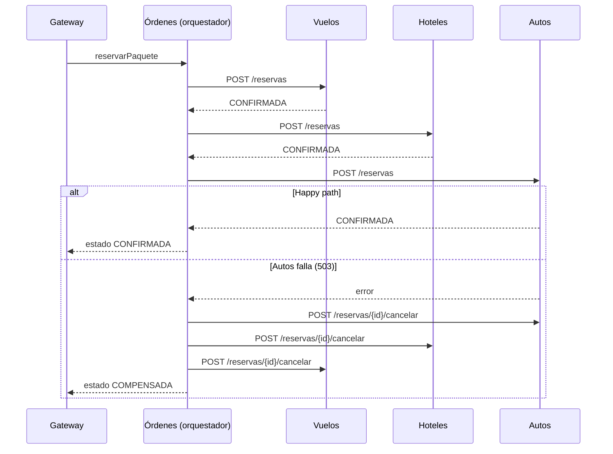

# WanderSync Travel Solutions

Plataforma de paquetes turísticos (vuelo + hotel + auto) construida con microservicios.
Parcial del segundo corte de **Patrones Arquitectónicos Avanzados**.

Tecnologías obligatorias: **Docker Compose, GraphQL, patrón SAGA, Dask y Prefect**.
Stack elegido: **Python** (FastAPI + Strawberry GraphQL + PostgreSQL).

---

## Índice

1. [Cómo ejecutarlo](#1-cómo-ejecutarlo)
2. [Arquitectura](#2-arquitectura)
3. [Estructura del repositorio](#3-estructura-del-repositorio)
4. [Paso a paso: qué se ha construido](#4-paso-a-paso-qué-se-ha-construido)
5. [Cómo probarlo (GraphiQL)](#5-cómo-probarlo-graphiql)
6. [Demo del fallo y las compensaciones SAGA](#6-demo-del-fallo-y-las-compensaciones-saga)
   - [6b. Demo de Prefect + Dask](#6b-demo-de-prefect--dask)
   - [6c. Demo de seguridad](#6c-demo-de-seguridad)
7. [Avance del proyecto](#7-avance-del-proyecto)
8. [Problemas comunes](#8-problemas-comunes)

---

## 1. Cómo ejecutarlo

Requisito: tener **Docker Desktop** abierto.

```bash
docker compose up --build
```

La primera vez tarda varios minutos (instala Prefect y Dask). Cuando todo esté arriba, abre:

| URL | Qué es |
|---|---|
| **http://localhost:8000/graphql** | Editor GraphiQL del API Gateway |
| **http://localhost:4200** | Panel de Prefect (flows, tareas, reintentos, logs) |
| **http://localhost:8787** | Panel de Dask (workers y tareas en ejecución) |

> Docker necesita espacio en disco: deja al menos **5 GB libres**. Si el disco se llena, Docker Desktop se cuelga y hay que reiniciarlo.

Para apagar todo **y borrar la base de datos** (necesario si se modifica `db/init.sql`):

```bash
docker compose down -v
```

---

## 2. Arquitectura

```
                  ┌──────────────────────────────┐
  Frontend ──────►│  Gateway GraphQL  :8000      │   ← única puerta de entrada (único puerto expuesto)
                  └──────┬───────────────┬───────┘
          consultas      │               │  mutation reservarPaquete
     (en paralelo)       ▼               ▼
        ┌────────┬─────────┬────────┐  ┌──────────────────────┐
        │ Vuelos │ Hoteles │ Autos  │◄─┤ Órdenes (orquestador │
        └───┬────┴────┬────┴───┬────┘  │ de la SAGA)          │
            │         │        │       └──────────┬───────────┘
            ▼         ▼        ▼                  ▼
        ┌──────────────── PostgreSQL ──────────────────────┐
        │  BD vuelos │ BD hoteles │ BD autos │ BD ordenes  │   ← una base de datos por servicio
        └──────────────────────────────────────────────────┘
                                ▲ UPSERT en lote (tabla hoteles)
                                │
   Prefect Flow ──► Dask scheduler ──► Dask workers (x2) ──► descargar → estructurar → limpiar → guardar
   (cada 30 min,                                                  │
    retries, panel :4200)                                         ▼
                                                     Hostelworld.com (sitio comercial real)
```

### Decisiones de diseño (y por qué)

| Decisión | Justificación |
|---|---|
| **Una base de datos por microservicio** | Cada servicio es dueño de sus datos; ninguno puede hacer JOIN ni transacciones sobre los datos de otro. Esto es lo que hace **necesario** el patrón SAGA: no existe un `COMMIT` que abarque varios servicios. |
| **SAGA por orquestación** (no coreografía) | Toda la lógica del flujo vive en un solo lugar (servicio Órdenes): más fácil de entender, depurar, demostrar y dibujar. No requiere broker de mensajes. |
| **Compensaciones en orden inverso** | Se deshace lo último primero, porque los pasos posteriores pueden depender de los anteriores. |
| **Idempotencia con `saga_id`** | El `saga_id` es llave primaria en cada tabla `reservas`. Reintentar una reserva o una cancelación nunca duplica nada (`ON CONFLICT DO NOTHING`). Esto hace seguro reintentar. |
| **Las compensaciones se reintentan** (backoff 1s, 2s, 4s, 8s, 16s) | Una compensación no puede rendirse. Si agota los reintentos, la SAGA queda en `REQUIERE_ATENCION` (nunca falla en silencio). |
| **Cancelar = cambiar estado, no borrar** | Queda trazabilidad de lo que pasó. |
| **Tabla `sagas` como bitácora** | Se actualiza en cada paso: sirve de evidencia y permitiría retomar una SAGA si el orquestador se cae. |
| **`NUMERIC` para precios, no `FLOAT`** | `FLOAT` redondea en binario (`0.1 + 0.2 = 0.30000000000000004`); con dinero eso descuadra cuentas. |
| **Solo el Gateway expone puerto** | El frontend no puede saltarse el Gateway; los demás servicios solo son accesibles dentro de la red de Docker. |
| **Credenciales por variables de entorno** | La URL de la BD no está escrita en el código. |
| **Seguridad centralizada en el Gateway** | Es la única puerta de entrada: autenticación, sesiones y rate limiting se aplican en un solo lugar y nada puede saltárselos. |

---

## 3. Estructura del repositorio

```
├── docker-compose.yml   # Define y conecta todos los contenedores
├── db/
│   └── init.sql         # Crea las 4 bases de datos, tablas y datos de prueba
├── vuelos/              # Microservicio de Vuelos   (FastAPI)
├── hoteles/             # Microservicio de Hoteles  (FastAPI)
├── autos/               # Microservicio de Autos    (FastAPI) + interruptor de fallo
├── ordenes/             # Microservicio de Órdenes  = orquestador SAGA
├── gateway/             # API Gateway GraphQL (Strawberry) + seguridad.py
├── ingesta/             # Scraper + Prefect Flow + Dask (una imagen para 4 contenedores)
└── seguridad/           # Script y reporte de auditoría de dependencias (pip-audit)
```

Cada carpeta de servicio tiene:

- `Dockerfile`: cómo se construye la imagen del contenedor.
- `requirements.txt`: dependencias de Python.
- `main.py`: el código del servicio (comentado línea por línea).

---

## 4. Paso a paso: qué se ha construido

### Paso 1 — Docker Compose + primer microservicio (Vuelos)

- `vuelos/Dockerfile` construye una imagen con Python 3.12 y arranca el servidor con `uvicorn`.
- `docker-compose.yml` levanta **PostgreSQL** y **Vuelos**.
- Puntos clave:
  - Dentro de Compose los servicios se encuentran por **nombre** (`db`, `vuelos`...), no por `localhost`.
  - `depends_on: condition: service_healthy` hace que los servicios esperen a que Postgres esté listo. Sin esto arrancan antes que la BD y fallan.

### Paso 2 — Base de datos inicial

- `db/init.sql` se monta en `/docker-entrypoint-initdb.d/`. Postgres lo ejecuta **solo la primera vez** que crea la BD.
- Crea una base de datos por servicio (`vuelos`, `hoteles`, `autos`, `ordenes`) con sus tablas y datos de prueba.

### Paso 3 — Microservicios Hoteles y Autos

Los tres servicios (Vuelos, Hoteles, Autos) tienen la misma forma:

| Endpoint | Para qué |
|---|---|
| `GET /vuelos` · `/hoteles` · `/autos` | Listar (con filtro opcional `?destino=` / `?ciudad=`) |
| `POST /reservas` | **Acción** de la SAGA: reserva → estado `CONFIRMADA` |
| `POST /reservas/{saga_id}/cancelar` | **Compensación** de la SAGA: estado → `CANCELADA` |
| `GET /health` | Comprobar que el servicio está vivo |

Autos además tiene el interruptor `FORZAR_FALLO_AUTOS` para simular una caída (ver sección 6).

### Paso 4 — Orquestador SAGA (servicio Órdenes)

`ordenes/main.py` → `POST /ordenes`:

1. Crea un `saga_id` único y lo registra en la tabla `sagas` con estado `EN_CURSO`.
2. Llama **en orden**: Vuelos → Hoteles → Autos.
3. **Si todo sale bien** → `CONFIRMADA`.
4. **Si un paso falla** → `COMPENSANDO`: cancela en **orden inverso** todo lo que se intentó (incluido el paso que falló, por si alcanzó a reservar antes de un timeout; como cancelar es idempotente, es inofensivo) → `COMPENSADA`.
5. Si alguna cancelación agota sus reintentos → `REQUIERE_ATENCION`.



### Paso 5 — API Gateway GraphQL

`gateway/main.py` (Strawberry + FastAPI) expone en `/graphql`:

| Operación | Tipo | Qué hace |
|---|---|---|
| `paquetes(destino, noches)` | Query | Consulta Vuelos, Hoteles y Autos **en paralelo** (`asyncio.gather`), combina y calcula `precioTotal` |
| `orden(sagaId)` | Query | Estado de una reserva |
| `reservarPaquete(vueloId, hotelId, autoId)` | Mutation | Dispara la SAGA en Órdenes (**requiere sesión**) |
| `registrar`, `iniciarSesion`, `cerrarSesion`, `yo` | Mutation / Query | Autenticación (ver Paso 7) |

**¿Cómo se elimina el over-fetching?** En REST el servidor decide qué campos devuelve. En GraphQL **el cliente pide exactamente los campos que necesita** y recibe solo esos, en una única petición. Además, cada microservicio filtra por ciudad en su propia BD, así que entre servicios tampoco viajan datos innecesarios.

### Paso 6 — Scraping real + Dask + Prefect

`ingesta/flow.py` define un **Flow de Prefect** con 4 tareas por ciudad (MDE, CTG, SMR), ejecutadas **en paralelo en 2 workers de Dask**:

| Tarea | Qué hace | Reintentos |
|---|---|---|
| `descargar` | Lee `robots.txt`, verifica permiso y descarga la página de hostales de la ciudad | 3 (5s, 15s, 45s) |
| `estructurar` | Extrae nombre, precio y rating de cada tarjeta HTML (BeautifulSoup) | — |
| `limpiar` | Convierte textos a números (`"CO$58,349.63"` → `58349.63`), descarta precios inválidos | — |
| `guardar` | UPSERT en lote en la BD de hoteles (una conexión y una transacción por ciudad) | 2 |

- **Dask** reparte las tareas entre los workers (`.map()` lanza una tarea por ciudad). Prefect usa `DaskTaskRunner` para enviarlas al clúster.
- **Prefect** registra el flow (`serve`), lo programa **cada 30 minutos** y muestra en su panel el estado, la duración, los logs y los reintentos de cada tarea.
- **Persistencia sin cuellos de botella:** se guarda en lote (`executemany`) con `ON CONFLICT (url) DO UPDATE`, así re-scrapear actualiza precios en vez de duplicar hoteles.
- Los hostales reales aparecen en GraphQL con `fuente: "hostelworld"`, junto a los datos `semilla`.

#### Fuente de datos y scraping responsable

| Sitio | Resultado de la evaluación |
|---|---|
| Booking.com | Responde con un **desafío anti-bot (AWS WAF)**. Descartado: evadirlo no es aceptable. |
| Kayak | Su `robots.txt` prohíbe `/flights/`, `/hotels/`, `/cars/`. Descartado. |
| Despegar, Trivago | Responden **403** (bloqueo anti-bot). Descartados. |
| **Hostelworld** | `robots.txt` **permite** `/hostels/...` y la página llega completa. **Elegido.** |

Buenas prácticas aplicadas:

- Se respeta `robots.txt` usando **`protego`** (cumple el estándar RFC 9309). No se usa `urllib.robotparser`, de la librería estándar, porque interpreta mal reglas como `Disallow: /s?` y bloquea rutas permitidas.
- `User-Agent` honesto que identifica al bot del proyecto. No se disfraza de navegador.
- Una petición por ciudad por ejecución.
- Si el sitio responde con un desafío anti-bot, la tarea **falla**. No se intenta evadirlo.

### Paso 7 — Ciberseguridad por diseño

Todo vive en `gateway/seguridad.py`, porque el Gateway es la única puerta de entrada. Usuarios y sesiones se guardan en su propia base de datos (`auth`).

#### Contraseñas con Argon2id

- Algoritmo **Argon2id**, el recomendado por OWASP, con costo alto: `time_cost=3`, `memory_cost=64 MiB`, `parallelism=4`. Cada hash consume 64 MiB de RAM, lo que hace carísima la fuerza bruta con GPUs si alguien roba la BD.
- **Sal aleatoria** por contraseña: dos usuarios con la misma clave tienen hashes distintos. En la BD se ve así: `$argon2id$v=19$m=65536,t=3,p=4$...`
- Longitud de **10 a 128 caracteres**. El tope evita que alguien sature la CPU enviando contraseñas gigantes.
- **Anti-enumeración:** si el email no existe, igual se verifica contra un hash de relleno, para que la respuesta tarde lo mismo. El mensaje de error siempre es genérico: `Credenciales inválidas`.
- El hashing corre en un hilo aparte (`asyncio.to_thread`) para no bloquear las demás peticiones.

#### Sesiones y mitigación de Session Fixation

- **Sesiones del lado del servidor.** El navegador solo guarda un token aleatorio de 256 bits (`secrets.token_urlsafe(32)`). En la BD se guarda su **SHA-256**, no el token, así que si roban la BD no obtienen sesiones utilizables.
- **Session Fixation:** en **cada login exitoso** se **borra** la sesión que traía el navegador (que podría haber plantado un atacante) y se emite un **ID nuevo**. El ID que conocía el atacante deja de servir.
- La cookie es `HttpOnly` (JavaScript no la puede leer, así que un XSS no la roba), `SameSite=Strict` (protege contra CSRF) y `Secure` en producción (`COOKIE_SECURE=true` con HTTPS). Expira en 1 hora.
- `cerrarSesion` borra la sesión en el servidor, no solo la cookie.

#### Rate Limiting

Como todo pasa por un único endpoint `/graphql`, el límite se aplica **por operación**. Se usa una ventana deslizante (`limits`, *moving window*). Al excederlo, la respuesta es **HTTP 429 Too Many Requests**.

| Operación | Límite | Protege contra |
|---|---|---|
| `iniciarSesion` | 5/minuto por IP **y** 10 cada 15 minutos por email | Fuerza bruta: un atacante probando muchas cuentas, o muchas IPs atacando una cuenta |
| `registrar` | 3/minuto por IP | Creación masiva de cuentas |
| `reservarPaquete` (checkout) | 10/minuto por IP | Abuso y DoS del checkout |

> Limitación conocida: el contador vive en memoria, así que sirve para **una** réplica del Gateway. Con varias réplicas habría que pasar a Redis (`RedisStorage`).

#### Seguridad de la cadena de suministro (pip-audit)

`seguridad/auditar.sh` audita las dependencias de **cada** microservicio con `pip-audit` contra la base de vulnerabilidades de PyPI/OSV. Genera la evidencia formal en [`seguridad/auditoria-dependencias.md`](seguridad/auditoria-dependencias.md).

Último resultado: **0 vulnerabilidades conocidas en los 6 servicios.**

Para volver a ejecutarla (no requiere Python instalado):

```bash
docker run --rm -v "${PWD}:/w" -w /w python:3.12-slim sh seguridad/auditar.sh
```

> En Windows CMD, reemplaza `${PWD}` por `%cd%`.

---

## 5. Cómo probarlo (GraphiQL)

Abre **http://localhost:8000/graphql** y ejecuta:

**Consultar paquetes** (cambia los campos pedidos y observa cómo cambia la respuesta):

```graphql
{
  paquetes(destino: "MDE", noches: 3) {
    precioTotal
    hotel { nombre }
  }
}
```

Destinos con datos de prueba: `MDE`, `CTG`, `SMR`.

**Crear cuenta e iniciar sesión** (reservar requiere sesión; GraphiQL guarda la cookie automáticamente):

```graphql
mutation {
  registrar(email: "ana@test.co", password: "clave-super-segura") { id email }
}
```

```graphql
mutation {
  iniciarSesion(email: "ana@test.co", password: "clave-super-segura") { email }
}
```

**Reservar un paquete:**

```graphql
mutation {
  reservarPaquete(vueloId: 1, hotelId: 1, autoId: 1) {
    sagaId
    estado
  }
}
```

**Consultar una reserva:**

```graphql
{
  orden(sagaId: "PEGA-AQUI-EL-SAGA-ID") { estado paso }
}
```

---

## 6. Demo del fallo y las compensaciones SAGA

1. Crea un archivo `.env` en la raíz del repositorio con:

   ```
   FORZAR_FALLO_AUTOS=true
   ```

2. Reinicia solo el servicio de Autos:

   ```bash
   docker compose up -d autos
   ```

3. Inicia sesión (sección 5) y ejecuta la mutation `reservarPaquete` → debe responder `estado: "COMPENSADA"`.

4. Mira el log del orquestador:

   ```bash
   docker compose logs ordenes
   ```

   ```
   EN_CURSO: reservando vuelos
   EN_CURSO: reservando hoteles
   EN_CURSO: reservando autos
   COMPENSANDO: falló autos: Server error '503 Service Unavailable'
   compensado: autos
   compensado: hoteles
   compensado: vuelos
   COMPENSADA: falló autos; reservas previas canceladas
   ```

5. (Opcional) Verifica directamente en las bases de datos que las reservas quedaron `CANCELADA`:

   ```bash
   docker compose exec db psql -U postgres -d hoteles -c "SELECT * FROM reservas"
   ```

6. Para volver a la normalidad: borra el `.env` y vuelve a ejecutar `docker compose up -d autos`.

---

## 6b. Demo de Prefect + Dask

1. Abre el panel de Prefect: **http://localhost:4200** → **Deployments** → `ingesta-hoteles / hostelworld-cada-30-min` → botón **Run → Quick run**.
2. Al mismo tiempo, abre el panel de Dask: **http://localhost:8787**. Verás las tareas repartiéndose entre los 2 workers.
3. En Prefect, entra al flow run: aparecen las 12 tareas (4 por ciudad), sus estados y los logs (`MDE: 28 hostales guardados...`).
4. Comprueba los datos reales en GraphiQL:

   ```graphql
   { paquetes(destino: "MDE") { hotel { nombre rating fuente precioNoche } precioTotal } }
   ```

**Demo de reintentos.** A veces el primer intento ya falla solo por un error de red real (DNS) y se ve el reintento. Para forzarlo, agrega al `.env`:

```
PROB_FALLO_SCRAPER=0.5
```

```bash
docker compose up -d dask-worker
```

Lanza el flow otra vez. En Prefect verás `Retry 1/3 will start 5 second(s)` y, después, `Completed`. Para desactivarlo, borra esa línea y repite el comando.

---

## 6c. Demo de seguridad

Todo se demuestra desde GraphiQL (**http://localhost:8000/graphql**) y la terminal.

**1. Argon2id.** Registra un usuario y muestra el hash guardado:

```bash
docker compose exec db psql -U postgres -d auth -c "SELECT email, password_hash FROM usuarios"
```

Debe empezar por `$argon2id$v=19$m=65536,t=3,p=4$`. La contraseña no aparece por ningún lado.

**2. Session Fixation.** Con `curl` se simula que un atacante plantó la cookie `session=TOKEN-DEL-ATACANTE` y que la víctima inicia sesión:

```bash
curl -i http://localhost:8000/graphql -H "Content-Type: application/json" -H "Cookie: session=TOKEN-DEL-ATACANTE" -d "{\"query\":\"mutation { iniciarSesion(email: \\\"ana@test.co\\\", password: \\\"clave-super-segura\\\") { email } }\"}"
```

En la respuesta, `set-cookie: session=...` trae un **ID nuevo**, distinto al del atacante, con `HttpOnly` y `SameSite=strict`. Para comprobar que el token del atacante no sirve:

```bash
curl http://localhost:8000/graphql -H "Content-Type: application/json" -H "Cookie: session=TOKEN-DEL-ATACANTE" -d "{\"query\":\"{ yo { email } }\"}"
```

Debe responder `{"data":{"yo":null}}`.

**3. Rate limiting.** En GraphiQL, ejecuta `iniciarSesion` con una contraseña incorrecta 6 veces seguidas. A partir del 6.º intento (o antes, si ya hiciste logins en ese minuto) responde `Demasiados intentos...` con HTTP 429.

**4. Ruta protegida.** Ejecuta `cerrarSesion` y luego `reservarPaquete`. Debe responder `Debes iniciar sesión para reservar`.

**5. Supply chain.** Muestra [`seguridad/auditoria-dependencias.md`](seguridad/auditoria-dependencias.md) o vuelve a ejecutar el script (Paso 7).

---

## 7. Avance del proyecto

- [x] Docker Compose + microservicios Vuelos, Hoteles, Autos, Órdenes
- [x] Una base de datos por servicio con datos de prueba
- [x] Patrón SAGA (orquestación) con compensaciones, reintentos e idempotencia
- [x] Simulación de fallo (`FORZAR_FALLO_AUTOS`)
- [x] API Gateway GraphQL (query `paquetes`, `orden`; mutation `reservarPaquete`)
- [x] Scraping real (Hostelworld) + Dask workers + Prefect Flow con retries y programación cada 30 min
- [x] Ciberseguridad: Argon2id, regeneración de sesión (Session Fixation), Rate Limiting, auditoría `pip-audit`
- [ ] Frontend mínimo consumiendo el Gateway
- [ ] Documento técnico de arquitectura

---

## 8. Problemas comunes

| Síntoma | Causa / solución |
|---|---|
| Cambié `db/init.sql` y no veo los cambios | El script solo corre al crear la BD. Ejecuta `docker compose down -v` y vuelve a levantar. |
| `port is already allocated` | Otro programa (o un stack anterior) usa el puerto 8000. Ejecuta `docker compose down` o cierra ese programa. |
| Un servicio se cae con error de conexión a la BD | Revisa que `depends_on` tenga `condition: service_healthy` para `db`. |
| `Debes iniciar sesión para reservar` | Ejecuta antes `iniciarSesion` en el mismo navegador (la sesión vive en una cookie). |
| `Demasiados intentos` (HTTP 429) | Es el rate limiting funcionando. Espera un minuto. |
| Error con la tabla `usuarios` o la BD `auth` | Se agregó en `init.sql` después de crear tu BD. Ejecuta `docker compose down -v` y vuelve a levantar. |
| El flow guarda 0 hostales | El sitio pudo cambiar su HTML. Revisa los selectores de `estructurar()` en `ingesta/flow.py`. |
| Comandos de Docker se quedan colgados | Probablemente el disco se llenó. Libera espacio y reinicia Docker Desktop. |
| La demo del fallo no falla | Verifica que el `.env` esté en la raíz y que reiniciaste Autos (`docker compose up -d autos`). Comprueba con `docker compose exec autos python -c "import os; print(os.environ['FORZAR_FALLO_AUTOS'])"`. |
