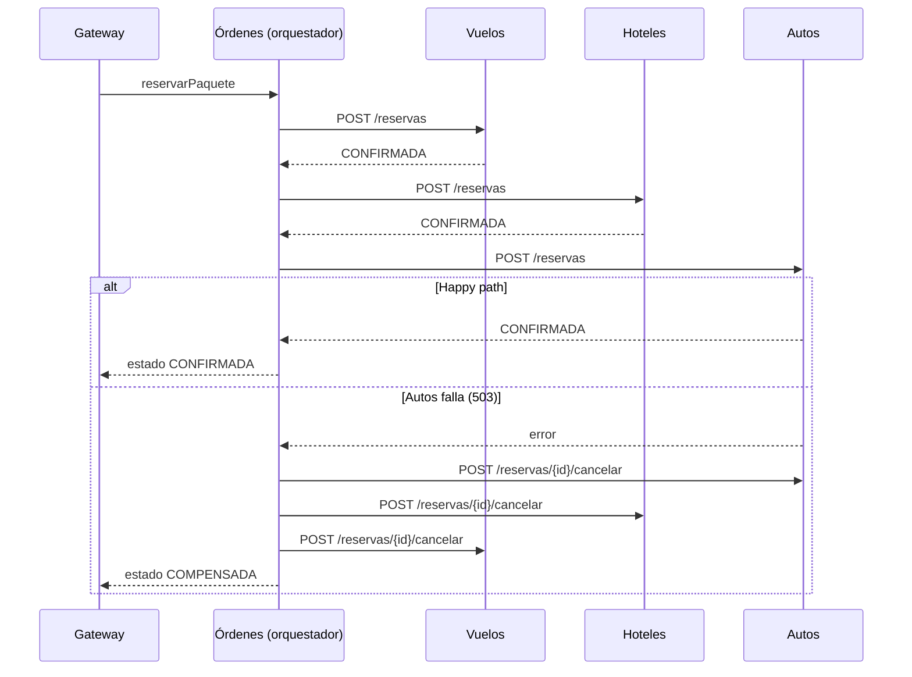

# WanderSync Travel Solutions

Plataforma de paquetes turísticos (vuelo + hotel + auto) construida con microservicios.
Parcial del segundo corte de **Patrones Arquitectónicos Avanzados**.

Tecnologías obligatorias: **Docker Compose, GraphQL, patrón SAGA, Dask y Prefect**.
Stack elegido: **Python** (FastAPI + Strawberry GraphQL + PostgreSQL).

---

## Índice

1. [Cómo ejecutarlo](#1-cómo-ejecutarlo)
2. [Arquitectura](#2-arquitectura)
3. [Estructura del repositorio](#3-estructura-del-repositorio)
4. [Paso a paso: qué se ha construido](#4-paso-a-paso-qué-se-ha-construido)
5. [Cómo probarlo (GraphiQL)](#5-cómo-probarlo-graphiql)
6. [Demo del fallo y las compensaciones SAGA](#6-demo-del-fallo-y-las-compensaciones-saga)
7. [Avance del proyecto](#7-avance-del-proyecto)
8. [Problemas comunes](#8-problemas-comunes)

---

## 1. Cómo ejecutarlo

Requisito: tener **Docker Desktop** abierto.

```bash
docker compose up --build
```

Cuando en el log aparezca `Uvicorn running` en todos los servicios, abre:

**http://localhost:8000/graphql** → editor GraphiQL del API Gateway.

Para apagar todo **y borrar la base de datos** (necesario si se modifica `db/init.sql`):

```bash
docker compose down -v
```

---

## 2. Arquitectura

```
                  ┌──────────────────────────────┐
  Frontend ──────►│  Gateway GraphQL  :8000      │   ← única puerta de entrada (único puerto expuesto)
                  └──────┬───────────────┬───────┘
          consultas      │               │  mutation reservarPaquete
     (en paralelo)       ▼               ▼
        ┌────────┬─────────┬────────┐  ┌──────────────────────┐
        │ Vuelos │ Hoteles │ Autos  │◄─┤ Órdenes (orquestador │
        └───┬────┴────┬────┴───┬────┘  │ de la SAGA)          │
            │         │        │       └──────────┬───────────┘
            ▼         ▼        ▼                  ▼
        ┌──────────────── PostgreSQL ──────────────────────┐
        │  BD vuelos │ BD hoteles │ BD autos │ BD ordenes  │   ← una base de datos por servicio
        └──────────────────────────────────────────────────┘
                         ▲
        (pendiente) Prefect Flow ──► Dask workers ──► scraping / limpieza / ingesta
```

### Decisiones de diseño (y por qué)

| Decisión | Justificación |
|---|---|
| **Una base de datos por microservicio** | Cada servicio es dueño de sus datos; ninguno puede hacer JOIN ni transacciones sobre los datos de otro. Esto es lo que hace **necesario** el patrón SAGA: no existe un `COMMIT` que abarque varios servicios. |
| **SAGA por orquestación** (no coreografía) | Toda la lógica del flujo vive en un solo lugar (servicio Órdenes): más fácil de entender, depurar, demostrar y dibujar. No requiere broker de mensajes. |
| **Compensaciones en orden inverso** | Se deshace lo último primero, porque los pasos posteriores pueden depender de los anteriores. |
| **Idempotencia con `saga_id`** | El `saga_id` es llave primaria en cada tabla `reservas`. Reintentar una reserva o una cancelación nunca duplica nada (`ON CONFLICT DO NOTHING`). Esto hace seguro reintentar. |
| **Las compensaciones se reintentan** (backoff 1s, 2s, 4s, 8s, 16s) | Una compensación no puede rendirse. Si agota los reintentos, la SAGA queda en `REQUIERE_ATENCION` (nunca falla en silencio). |
| **Cancelar = cambiar estado, no borrar** | Queda trazabilidad de lo que pasó. |
| **Tabla `sagas` como bitácora** | Se actualiza en cada paso: sirve de evidencia y permitiría retomar una SAGA si el orquestador se cae. |
| **`NUMERIC` para precios, no `FLOAT`** | `FLOAT` redondea en binario (`0.1 + 0.2 = 0.30000000000000004`); con dinero eso descuadra cuentas. |
| **Solo el Gateway expone puerto** | El frontend no puede saltarse el Gateway; los demás servicios solo son accesibles dentro de la red de Docker. |
| **Credenciales por variables de entorno** | La URL de la BD no está escrita en el código. |

---

## 3. Estructura del repositorio

```
├── docker-compose.yml   # Define y conecta todos los contenedores
├── db/
│   └── init.sql         # Crea las 4 bases de datos, tablas y datos de prueba
├── vuelos/              # Microservicio de Vuelos   (FastAPI)
├── hoteles/             # Microservicio de Hoteles  (FastAPI)
├── autos/               # Microservicio de Autos    (FastAPI) + interruptor de fallo
├── ordenes/             # Microservicio de Órdenes  = orquestador SAGA
└── gateway/             # API Gateway GraphQL (Strawberry)
```

Cada carpeta de servicio tiene:

- `Dockerfile`: cómo se construye la imagen del contenedor.
- `requirements.txt`: dependencias de Python.
- `main.py`: el código del servicio (comentado línea por línea).

---

## 4. Paso a paso: qué se ha construido

### Paso 1 — Docker Compose + primer microservicio (Vuelos)

- `vuelos/Dockerfile` construye una imagen con Python 3.12 y arranca el servidor con `uvicorn`.
- `docker-compose.yml` levanta **PostgreSQL** y **Vuelos**.
- Puntos clave:
  - Dentro de Compose los servicios se encuentran por **nombre** (`db`, `vuelos`...), no por `localhost`.
  - `depends_on: condition: service_healthy` hace que los servicios esperen a que Postgres esté listo. Sin esto arrancan antes que la BD y fallan.

### Paso 2 — Base de datos inicial

- `db/init.sql` se monta en `/docker-entrypoint-initdb.d/`. Postgres lo ejecuta **solo la primera vez** que crea la BD.
- Crea una base de datos por servicio (`vuelos`, `hoteles`, `autos`, `ordenes`) con sus tablas y datos de prueba.

### Paso 3 — Microservicios Hoteles y Autos

Los tres servicios (Vuelos, Hoteles, Autos) tienen la misma forma:

| Endpoint | Para qué |
|---|---|
| `GET /vuelos` · `/hoteles` · `/autos` | Listar (con filtro opcional `?destino=` / `?ciudad=`) |
| `POST /reservas` | **Acción** de la SAGA: reserva → estado `CONFIRMADA` |
| `POST /reservas/{saga_id}/cancelar` | **Compensación** de la SAGA: estado → `CANCELADA` |
| `GET /health` | Comprobar que el servicio está vivo |

Autos además tiene el interruptor `FORZAR_FALLO_AUTOS` para simular una caída (ver sección 6).

### Paso 4 — Orquestador SAGA (servicio Órdenes)

`ordenes/main.py` → `POST /ordenes`:

1. Crea un `saga_id` único y lo registra en la tabla `sagas` con estado `EN_CURSO`.
2. Llama **en orden**: Vuelos → Hoteles → Autos.
3. **Si todo sale bien** → `CONFIRMADA`.
4. **Si un paso falla** → `COMPENSANDO`: cancela en **orden inverso** todo lo que se intentó (incluido el paso que falló, por si alcanzó a reservar antes de un timeout; como cancelar es idempotente, es inofensivo) → `COMPENSADA`.
5. Si alguna cancelación agota sus reintentos → `REQUIERE_ATENCION`.



### Paso 5 — API Gateway GraphQL

`gateway/main.py` (Strawberry + FastAPI) expone en `/graphql`:

| Operación | Tipo | Qué hace |
|---|---|---|
| `paquetes(destino, noches)` | Query | Consulta Vuelos, Hoteles y Autos **en paralelo** (`asyncio.gather`), combina y calcula `precioTotal` |
| `orden(sagaId)` | Query | Estado de una reserva |
| `reservarPaquete(vueloId, hotelId, autoId)` | Mutation | Dispara la SAGA en Órdenes |

**¿Cómo se elimina el over-fetching?** En REST el servidor decide qué campos devuelve. En GraphQL **el cliente pide exactamente los campos que necesita** y recibe solo esos, en una única petición. Además, cada microservicio filtra por ciudad en su propia BD, así que entre servicios tampoco viajan datos innecesarios.

---

## 5. Cómo probarlo (GraphiQL)

Abre **http://localhost:8000/graphql** y ejecuta:

**Consultar paquetes** (cambia los campos pedidos y observa cómo cambia la respuesta):

```graphql
{
  paquetes(destino: "MDE", noches: 3) {
    precioTotal
    hotel { nombre }
  }
}
```

Destinos con datos de prueba: `MDE`, `CTG`, `SMR`.

**Reservar un paquete:**

```graphql
mutation {
  reservarPaquete(vueloId: 1, hotelId: 1, autoId: 1) {
    sagaId
    estado
  }
}
```

**Consultar una reserva:**

```graphql
{
  orden(sagaId: "PEGA-AQUI-EL-SAGA-ID") { estado paso }
}
```

---

## 6. Demo del fallo y las compensaciones SAGA

1. Crea un archivo `.env` en la raíz del repositorio con:

   ```
   FORZAR_FALLO_AUTOS=true
   ```

2. Reinicia solo el servicio de Autos:

   ```bash
   docker compose up -d autos
   ```

3. Ejecuta la mutation `reservarPaquete` → debe responder `estado: "COMPENSADA"`.

4. Mira el log del orquestador:

   ```bash
   docker compose logs ordenes
   ```

   ```
   EN_CURSO: reservando vuelos
   EN_CURSO: reservando hoteles
   EN_CURSO: reservando autos
   COMPENSANDO: falló autos: Server error '503 Service Unavailable'
   compensado: autos
   compensado: hoteles
   compensado: vuelos
   COMPENSADA: falló autos; reservas previas canceladas
   ```

5. (Opcional) Verifica directamente en las bases de datos que las reservas quedaron `CANCELADA`:

   ```bash
   docker compose exec db psql -U postgres -d hoteles -c "SELECT * FROM reservas"
   ```

6. Para volver a la normalidad: borra el `.env` y vuelve a ejecutar `docker compose up -d autos`.

---

## 7. Avance del proyecto

- [x] Docker Compose + microservicios Vuelos, Hoteles, Autos, Órdenes
- [x] Una base de datos por servicio con datos de prueba
- [x] Patrón SAGA (orquestación) con compensaciones, reintentos e idempotencia
- [x] Simulación de fallo (`FORZAR_FALLO_AUTOS`)
- [x] API Gateway GraphQL (query `paquetes`, `orden`; mutation `reservarPaquete`)
- [ ] Scraping + Dask workers + Prefect Flow con retries (pendiente: confirmar con el profesor si la fuente debe ser real o mock)
- [ ] Ciberseguridad: Argon2id, regeneración de sesión (Session Fixation), Rate Limiting, `pip-audit`
- [ ] Frontend mínimo consumiendo el Gateway
- [ ] Documento técnico de arquitectura

---

## 8. Problemas comunes

| Síntoma | Causa / solución |
|---|---|
| Cambié `db/init.sql` y no veo los cambios | El script solo corre al crear la BD. Ejecuta `docker compose down -v` y vuelve a levantar. |
| `port is already allocated` | Otro programa (o un stack anterior) usa el puerto 8000. Ejecuta `docker compose down` o cierra ese programa. |
| Un servicio se cae con error de conexión a la BD | Revisa que `depends_on` tenga `condition: service_healthy` para `db`. |
| La demo del fallo no falla | Verifica que el `.env` esté en la raíz y que reiniciaste Autos (`docker compose up -d autos`). Comprueba con `docker compose exec autos python -c "import os; print(os.environ['FORZAR_FALLO_AUTOS'])"`. |
