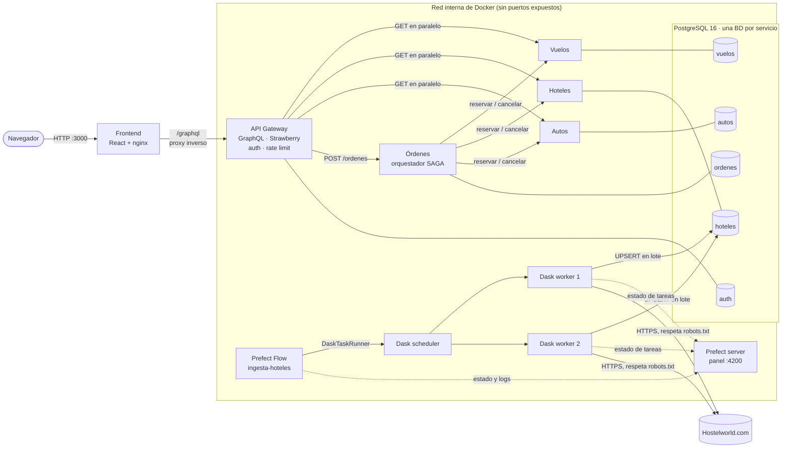
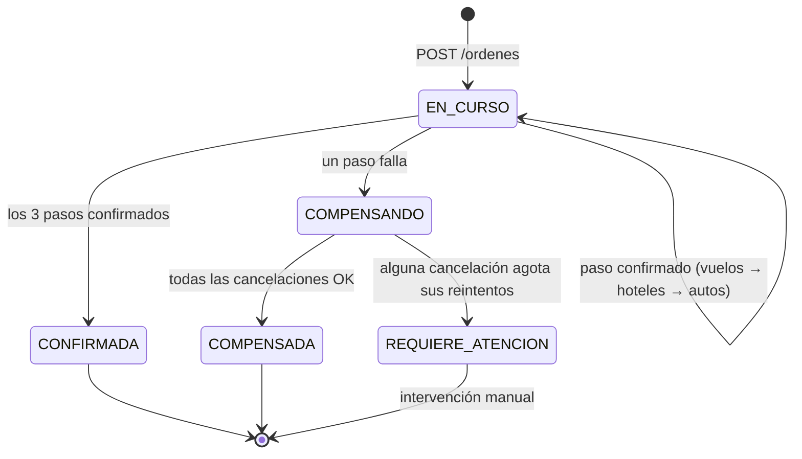
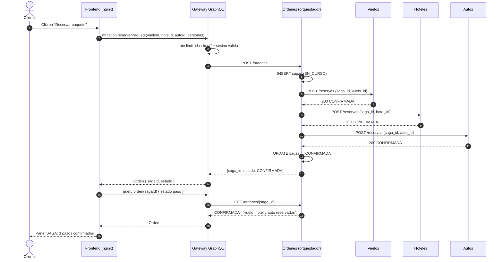
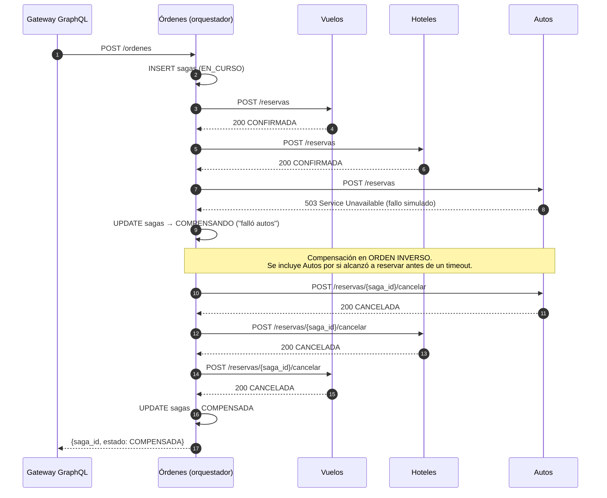
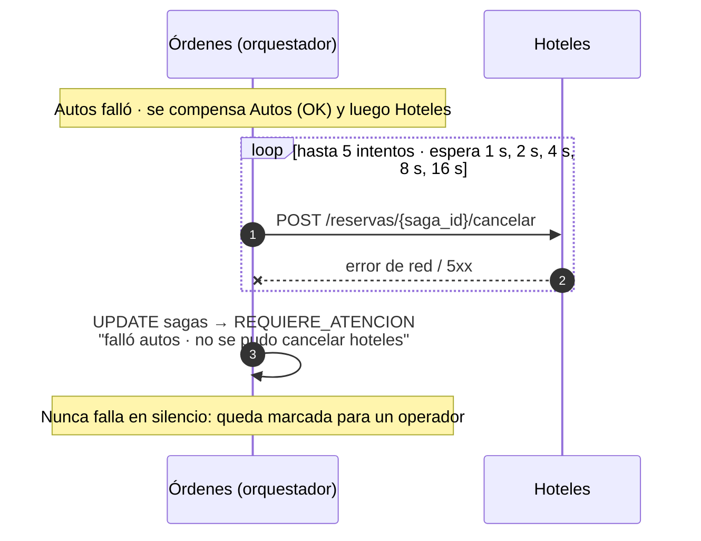
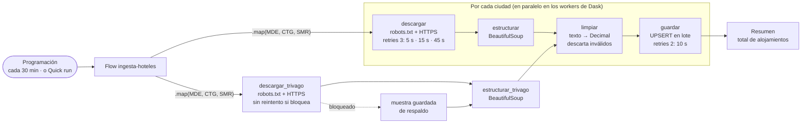
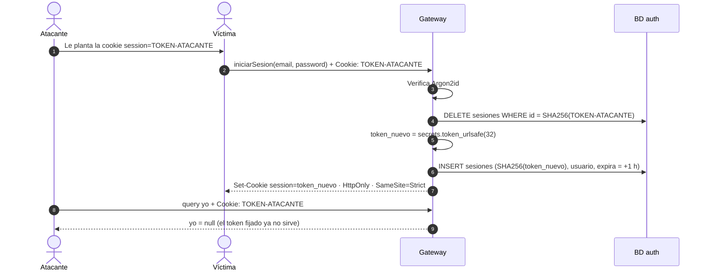

# Documento técnico de arquitectura — WanderSync Travel Solutions

**Asignatura:** Patrones Arquitectónicos Avanzados · **Evaluación:** Parcial práctico del segundo corte
**Proyecto:** Plataforma de empaquetamiento turístico dinámico (vuelo + hotel + auto)
**Repositorio:** `Yuly2222/Parcial2Patrones---WanderSync-Travel-Solutions`
**Fecha:** octubre de 2026

---

## Contenido

1. [Resumen](#1-resumen)
2. [Contexto y problema](#2-contexto-y-problema)
3. [Trazabilidad: requisitos → solución](#3-trazabilidad-requisitos--solución)
4. [Vista general de la arquitectura](#4-vista-general-de-la-arquitectura)
5. [Decisiones arquitectónicas](#5-decisiones-arquitectónicas)
6. [Patrón SAGA](#6-patrón-saga)
7. [API Gateway GraphQL](#7-api-gateway-graphql)
8. [Ingesta distribuida: Dask + Prefect](#8-ingesta-distribuida-dask--prefect)
9. [Ciberseguridad por diseño](#9-ciberseguridad-por-diseño)
10. [Frontend](#10-frontend)
11. [Despliegue con Docker Compose](#11-despliegue-con-docker-compose)
12. [Guion de la demostración](#12-guion-de-la-demostración)
13. [Limitaciones conocidas y trabajo futuro](#13-limitaciones-conocidas-y-trabajo-futuro)
14. [Conclusiones](#14-conclusiones)

---

## 1. Resumen

WanderSync vende paquetes que combinan un vuelo, un hotel y un auto. Cada componente lo gestiona un microservicio con **su propia base de datos**, así que reservar un paquete es una **transacción distribuida**: no existe un `COMMIT` que abarque los tres servicios.

La solución se apoya en cinco piezas:

| Pieza | Rol en la arquitectura |
|---|---|
| **Patrón SAGA (orquestación)** | El servicio Órdenes ejecuta vuelo → hotel → auto y, si un paso falla, compensa en orden inverso. Elimina las "reservas huérfanas". |
| **API Gateway GraphQL** | Única puerta de entrada del frontend. Consolida los tres servicios en una consulta y evita el over-fetching. |
| **Dask** | Clúster (scheduler + 2 workers) que paraleliza el scraping, la limpieza y la ingesta de tarifas reales. |
| **Prefect** | Orquesta el flujo de ingesta sobre Dask: programación cada 30 min, reintentos con backoff y panel de observabilidad. |
| **Docker Compose** | Todo el ecosistema (11 contenedores) se levanta con `docker compose up --build`. |

Stack: **Python 3.12** (FastAPI, Strawberry GraphQL, psycopg 3), **PostgreSQL 16**, **React 19 + Vite + Tailwind** servido por **nginx**.

---

## 2. Contexto y problema

La arquitectura previa de WanderSync tenía dos fallas:

1. **Reservas huérfanas.** El pago y el vuelo se confirmaban, pero si la reserva del hotel o del auto fallaba en la red, la orden quedaba en un estado indeterminado y nada revertía lo ya reservado.
2. **Cuellos de botella en la sincronización de tarifas.** La actualización masiva de precios bloqueaba la capa de persistencia y la red, afectando a los servicios que atienden clientes.

Además, la empresa quiere dejar de depender de APIs comerciales cerradas y obtener tarifas mediante **extracción automatizada** de fuentes públicas.

Objetivos de diseño que se derivan:

- **Consistencia eventual garantizada:** una reserva termina siempre en *todo confirmado* o *todo cancelado*, nunca a medias.
- **Ingesta desacoplada:** el scraping corre en segundo plano, distribuido, y escribe en lote; nunca en el camino de una petición del cliente.
- **Observabilidad:** se puede ver en qué estado está cada SAGA y cada ejecución de ingesta.
- **Seguridad por diseño:** autenticación robusta, protección contra fuerza bruta y control de la cadena de suministro.

---

## 3. Trazabilidad: requisitos → solución

| Requisito del enunciado | Cómo se cumple | Dónde está |
|---|---|---|
| Microservicios Vuelos, Hoteles, Autos, Órdenes y Gateway | Cinco servicios FastAPI independientes, cada uno con su `Dockerfile` | `vuelos/`, `hoteles/`, `autos/`, `ordenes/`, `gateway/` |
| Despliegue con un único comando | `docker compose up --build` levanta los 11 contenedores, con `depends_on` + healthchecks | `docker-compose.yml` |
| GraphQL como API Gateway unificado | Strawberry sobre FastAPI; el frontend solo conoce `/graphql` | `gateway/main.py`, `frontend/nginx.conf` |
| Consultas complejas sin over-fetching | `paquetes(destino, noches, personas)` consolida 3 servicios en paralelo; el cliente elige los campos | §7 |
| Mutaciones de reserva | `reservarPaquete` dispara la SAGA | §6, §7 |
| SAGA con happy path y compensaciones automáticas | Orquestador con compensación en orden inverso, reintentos e idempotencia | `ordenes/main.py`, §6 |
| Fallo simulado | Interruptor `FORZAR_FALLO_AUTOS=true` (Autos responde 503) | `autos/main.py` |
| Dask para recolección e ingesta | Scheduler + 2 workers; `DaskTaskRunner` reparte las tareas | `ingesta/flow.py`, §8 |
| Fuentes reales (Google Flights, Kayak, Booking...) | Hostelworld en vivo y Trivago con BeautifulSoup; Trivago bloquea al bot (403), así que se usan sus páginas guardadas de respaldo | `ingesta/flow.py`, `ingesta/trivago.py`, §8.4–8.5 |
| Prefect con retries y monitoreo | Flow `ingesta-hoteles`, retries 5 s/15 s/45 s, panel en `:4200` | `ingesta/flow.py`, §8 |
| Persistencia con integración GraphQL | PostgreSQL expuesto mediante el Gateway GraphQL (justificación en §5.6) | `db/init.sql`, §5.6 |
| Session Fixation | Se destruye la sesión previa y se emite un ID nuevo en cada login | `gateway/seguridad.py`, §9.2 |
| Hashing robusto | Argon2id (t=3, m=64 MiB, p=4) con sal aleatoria | §9.1 |
| Rate Limiting en login, pago y checkout | Ventana deslizante por operación; HTTP 429 | §9.3 |
| Auditoría de la cadena de suministro | `pip-audit` (6 servicios) y `npm audit` (frontend): 0 vulnerabilidades | `seguridad/`, §9.5 |
| Frontend que consume la API | SPA React con panel SAGA e inspector GraphQL | `frontend/`, §10 |

---

## 4. Vista general de la arquitectura

### 4.1 Diagrama de componentes



### 4.2 Responsabilidades

| Componente | Responsabilidad | Datos que posee |
|---|---|---|
| **Frontend** (nginx) | Interfaz; reenvía `/graphql` al Gateway; cabeceras de seguridad | — |
| **Gateway** | Esquema GraphQL, composición de paquetes, autenticación, sesiones, rate limiting | BD `auth` (`usuarios`, `sesiones`) |
| **Vuelos** | Catálogo de vuelos; acción y compensación de reserva de vuelo | BD `vuelos` |
| **Hoteles** | Catálogo de hoteles (semilla + scraping); reserva/cancelación de hotel | BD `hoteles` |
| **Autos** | Catálogo de autos; reserva/cancelación de auto; interruptor de fallo | BD `autos` |
| **Órdenes** | Orquestador de la SAGA; bitácora de cada transacción | BD `ordenes` (`sagas`) |
| **Prefect server** | Historial de flows y tareas, programación, panel web | Interna de Prefect |
| **Dask scheduler / workers** | Reparto y ejecución distribuida de las tareas de ingesta | — |
| **Ingesta** | Registra el flow en Prefect (`serve`) y lo dispara cada 30 min | — |

### 4.3 Estilo arquitectónico

- **Microservicios con *database per service***: cada servicio es dueño exclusivo de sus datos.
- **API Gateway** como fachada única (patrón *Backend for Frontend* simplificado).
- **SAGA orquestada** para la consistencia entre servicios.
- **Procesamiento por lotes asíncrono** (pipeline ETL distribuido) para la ingesta, separado del camino de las peticiones.

---

## 5. Decisiones arquitectónicas

Cada decisión se presenta como un registro breve (contexto → decisión → consecuencias).

### 5.1 Una base de datos por microservicio

- **Contexto.** Si los servicios compartieran tablas, un cambio en una rompería a los demás y el sistema seguiría siendo un monolito distribuido.
- **Decisión.** Un único servidor PostgreSQL (por simplicidad de despliegue) con **cinco bases de datos lógicas**. Cada servicio recibe solo la URL de la suya por variable de entorno.
- **Consecuencias.** (+) Aislamiento y autonomía. (−) Ya no hay JOIN ni transacciones entre servicios → **por eso es necesario el patrón SAGA**. En producción, cada BD podría moverse a su propio servidor sin cambiar código.

### 5.2 SAGA por orquestación (no coreografía)

| Criterio | Orquestación (elegida) | Coreografía |
|---|---|---|
| Dónde vive la lógica del flujo | En un solo servicio (Órdenes) | Repartida entre todos los servicios |
| Infraestructura adicional | Ninguna (HTTP) | Broker de mensajes (Kafka, RabbitMQ…) |
| Depuración y trazabilidad | Una bitácora central (`sagas`) | Hay que reconstruir el flujo desde eventos |
| Acoplamiento | Órdenes conoce a los participantes | Los servicios se conocen solo por eventos |
| Riesgo de dependencias cíclicas | Bajo | Alto con muchos participantes |

- **Decisión.** Orquestación: con tres participantes y un flujo lineal, centralizar la lógica hace el sistema más fácil de entender, demostrar y dibujar, y evita operar un broker.
- **Consecuencias.** Órdenes es un punto central; se mitiga con la bitácora persistente (§13 describe la recuperación pendiente).

### 5.3 Idempotencia con `saga_id`

- El orquestador genera un `UUID` por transacción y lo envía a cada participante.
- En cada tabla `reservas`, `saga_id` es **llave primaria** e `INSERT … ON CONFLICT (saga_id) DO NOTHING`.
- La cancelación es un `UPDATE … SET estado = 'CANCELADA'`, idempotente por naturaleza.
- **Consecuencia clave:** reintentar cualquier paso o compensación es seguro. Esto permite reintentar con backoff y compensar también el paso que dio *timeout* (puede haber reservado sin que el orquestador se enterara).

### 5.4 Compensar es cambiar estado, no borrar

Las reservas canceladas permanecen con `estado = 'CANCELADA'`. Así queda trazabilidad completa para auditoría y para la demo.

### 5.5 GraphQL en un Gateway propio (Strawberry)

- **Contexto.** El frontend necesita combinar datos de tres servicios; con REST serían tres llamadas y datos de sobra.
- **Decisión.** Gateway GraphQL en Python (Strawberry + FastAPI) que consulta los servicios **en paralelo** (`asyncio.gather`) y compone el tipo `Paquete`.
- **Consecuencias.** (+) Una sola petición, campos a elección del cliente, un único lugar para aplicar seguridad. (−) El Gateway conoce las direcciones internas de los servicios.

### 5.6 Persistencia e integración con GraphQL

El enunciado sugiere un motor con GraphQL nativo (por ejemplo, Supabase con `pg_graphql`). Se evaluó y se optó por **PostgreSQL expuesto a través del Gateway GraphQL**:

- `pg_graphql` genera un esquema GraphQL **de una sola base de datos**. Usarlo como API del frontend lo acoplaría directamente a las tablas y rompería *database per service*: el paquete combina datos de cuatro bases distintas.
- Exponer la BD directamente al cliente se saltaría la capa de autenticación, rate limiting y la SAGA.
- Con el Gateway, la fuente unificada para el frontend sigue siendo un esquema GraphQL, pero respaldado por servicios que validan las reglas de negocio.
- Los datos que procesan los workers de Dask se persisten directamente en la BD `hoteles` y aparecen de inmediato en la consulta `paquetes` (campo `fuente: "hostelworld"`).

Migrar a Supabase sería directo: es PostgreSQL, así que bastaría cambiar las `DATABASE_URL`.

### 5.7 `NUMERIC` para dinero

Los precios se almacenan como `NUMERIC(12,2)` y el scraper limpia con `Decimal`: `FLOAT` introduce errores de redondeo binario (`0.1 + 0.2 ≠ 0.3`) que, con dinero, descuadran cuentas. (Ver la limitación sobre el transporte en §13.)

### 5.8 Solo el frontend y el Gateway exponen puertos

Vuelos, Hoteles, Autos y Órdenes no publican puertos: solo son accesibles dentro de la red de Docker, así que **nadie puede saltarse el Gateway**. El frontend llega al Gateway a través de nginx en el mismo origen (`localhost:3000/graphql`). El puerto 8000 del Gateway se mantiene abierto para la demostración con GraphiQL.

---

## 6. Patrón SAGA

### 6.1 Pasos y compensaciones

| # | Participante | Acción (`POST /reservas`) | Compensación (`POST /reservas/{saga_id}/cancelar`) |
|---|---|---|---|
| 1 | Vuelos | Inserta reserva `CONFIRMADA` | Estado → `CANCELADA` |
| 2 | Hoteles | Inserta reserva `CONFIRMADA` | Estado → `CANCELADA` |
| 3 | Autos | Inserta reserva `CONFIRMADA` (o 503 si `FORZAR_FALLO_AUTOS`) | Estado → `CANCELADA` |

Reglas del orquestador (`ordenes/main.py`):

1. Registra la SAGA en la tabla `sagas` con estado `EN_CURSO` **antes** de empezar.
2. Ejecuta los pasos **en orden** y actualiza la bitácora en cada uno.
3. Apila cada participante **antes** de llamarlo. Si la llamada falla o da *timeout*, también se compensa (cancelar algo que no se reservó es inofensivo gracias a la idempotencia).
4. Ante un fallo, compensa en **orden inverso** (lo último primero).
5. Cada compensación se reintenta con **backoff exponencial** (1 s, 2 s, 4 s, 8 s, 16 s): una compensación no puede rendirse.
6. Si una compensación agota sus reintentos, la SAGA queda en `REQUIERE_ATENCION`: nunca falla en silencio.

### 6.2 Máquina de estados



### 6.3 Diagrama de secuencia — camino exitoso (happy path)



### 6.4 Diagrama de secuencia — fallo y compensaciones



### 6.5 Diagrama de secuencia — compensación que no se logra



### 6.6 Evidencia obtenida en las pruebas

Log del orquestador con `FORZAR_FALLO_AUTOS=true`:

```
[SAGA 4c6df63d-…] EN_CURSO: reservando vuelos
[SAGA 4c6df63d-…] EN_CURSO: reservando hoteles
[SAGA 4c6df63d-…] EN_CURSO: reservando autos
[SAGA 4c6df63d-…] COMPENSANDO: falló autos: Server error '503 Service Unavailable' for url 'http://autos:8000/reservas'
[SAGA 4c6df63d-…] compensado: autos
[SAGA 4c6df63d-…] compensado: hoteles
[SAGA 4c6df63d-…] compensado: vuelos
[SAGA 4c6df63d-…] COMPENSADA: falló autos; reservas previas canceladas
```

Estado en la BD de hoteles tras una reserva exitosa y una compensada:

```
  estado   | count
-----------+-------
 CANCELADA |     1
 CONFIRMADA|     1
```

---

## 7. API Gateway GraphQL

### 7.1 Esquema (SDL)

```graphql
type Query {
  "Paquetes disponibles (vuelo + hotel + auto) hacia una ciudad destino"
  paquetes(destino: String!, noches: Int! = 1, personas: Int! = 1): [Paquete!]!   # personas: 1 a 9
  "Estado de una reserva (SAGA) por su id"
  orden(sagaId: String!): Orden
  "Usuario de la sesión actual (null si no hay sesión)"
  yo: Usuario
}

type Mutation {
  registrar(email: String!, password: String!): Usuario!
  iniciarSesion(email: String!, password: String!): Usuario!   # emite una sesión NUEVA
  cerrarSesion: Boolean!
  reservarPaquete(vueloId: Int!, hotelId: Int!, autoId: Int!, personas: Int! = 1): Orden!  # requiere sesión; dispara la SAGA
}

type Paquete { vuelo: Vuelo!  hotel: Hotel!  auto: Auto!  personas: Int!  habitaciones: Int!  autos: Int!  precioTotal: Float! }
type Vuelo   { id: Int!  origen: String!  destino: String!  precio: Float! }
type Hotel   { id: Int!  nombre: String!  ciudad: String!  precioNoche: Float!  rating: Float  fuente: String! }
type Auto    { id: Int!  modelo: String!  ciudad: String!  precioDia: Float! }
type Orden   { sagaId: String!  estado: String!  paso: String  personas: Int }
type Usuario { id: Int!  email: String! }
```

### 7.2 Cómo se elimina el over-fetching

- **En el borde (cliente ↔ Gateway):** el cliente declara los campos. La tarjeta de paquete del frontend no pide `hotel.ciudad` ni `auto.ciudad` (ya conoce el destino), así que no viajan. El inspector GraphQL de la interfaz muestra la consulta exacta y los bytes recibidos.
- **En el interior (Gateway ↔ servicios):** cada servicio filtra por ciudad **en su propia base de datos** (`WHERE destino = %s`); entre servicios no viajan registros que no se van a usar.
- **Una sola ida y vuelta:** las tres consultas internas se lanzan en paralelo con `asyncio.gather`; la latencia es la del servicio más lento, no la suma.

Ejemplo de consulta mínima y respuesta:

```graphql
{ paquetes(destino: "MDE", noches: 3) { precioTotal hotel { nombre } } }
```

```json
{ "data": { "paquetes": [ { "precioTotal": 751630.0, "hotel": { "nombre": "Casa Kiwi" } } ] } }
```

### 7.3 Cálculo del precio

`precioTotal = vuelo.precio × personas + (hotel.precioNoche × habitaciones + auto.precioDia × autos) × noches`

con `habitaciones = ⌈personas / 2⌉` (hasta 2 personas por habitación) y `autos = ⌈personas / 5⌉` (hasta 5 por vehículo). El Gateway valida 1 a 9 personas y 1 a 30 noches; el servicio Órdenes vuelve a validar el rango (Pydantic) y guarda `personas` en la tabla `sagas`.

---

## 8. Ingesta distribuida: Dask + Prefect

### 8.1 Roles

- **Prefect** es el "capataz": define el flujo, lo programa cada 30 minutos, reintenta las tareas que fallan y muestra estado, duración y logs en su panel (`:4200`).
- **Dask** es la "cuadrilla": el scheduler reparte las tareas entre **2 workers** (contenedores independientes) que las ejecutan en paralelo (panel en `:8787`).
- La integración es `DaskTaskRunner(address="tcp://dask-scheduler:8786")`: cada `@task` de Prefect se ejecuta en un worker de Dask y reporta su estado a Prefect.

### 8.2 Pipeline por ciudad



Son **12 tareas por ejecución** (4 × 3 ciudades). Las tareas se encadenan con *futures*: `estructurar(MDE)` empieza apenas termina `descargar(MDE)`, sin esperar a las otras ciudades. Una ciudad que falla definitivamente no tumba a las demás; el flow solo queda `Failed` si no se pudo ingerir ninguna.

### 8.3 Política de reintentos

| Tarea | Reintentos | Espera | Motivo |
|---|---|---|---|
| `descargar`, `descargar_trivago` | 3 | 5 s, 15 s, 45 s (backoff) | Errores de red, DNS, 5xx del sitio; no saturar un sitio que puede estar caído. **No** se reintenta un bloqueo (401/403/429 o anti-bot) |
| `guardar` | 2 | 10 s | Bloqueos o caídas momentáneas de la BD |
| `estructurar`, `estructurar_trivago`, `limpiar` | 0 | — | Son deterministas: reintentar daría el mismo resultado |

Para la demo, `PROB_FALLO_SCRAPER=0.5` provoca fallos de red simulados y en el panel de Prefect se ve `Retry 1/3 will start 5 second(s)` seguido de `Completed`.

### 8.4 Fuente de datos y scraping responsable

| Sitio | Resultado de la evaluación |
|---|---|
| Booking.com | Desafío anti-bot (AWS WAF). Descartado: evadirlo no es aceptable. |
| Kayak | `robots.txt` prohíbe `/flights/`, `/hotels/`, `/cars/`. Descartado. |
| Despegar | HTTP 403 (bloqueo anti-bot). Descartado. |
| **Trivago** | `robots.txt` prohíbe `/*/srl/` y `/hotel/`, pero permite las páginas de destino `/es-CO/odr/...`, que traen los hoteles en el HTML del servidor. **Elegido como segunda fuente** (§8.5). |
| **Hostelworld** | `robots.txt` permite `/hostels/...` y la página llega completa. **Elegido.** |

Prácticas aplicadas: se respeta `robots.txt` con `protego` (cumple RFC 9309; `urllib.robotparser` interpreta mal reglas como `Disallow: /s?`), `User-Agent` honesto que identifica al bot, una petición por ciudad por ejecución y, si aparece un desafío anti-bot, la tarea **falla** en lugar de intentar evadirlo.

Vuelos y autos se sirven con datos semilla (mock), lo que el enunciado permite.

### 8.5 Segunda fuente: Trivago (BeautifulSoup) con respaldo

**Resultado de la prueba real (6 de octubre de 2026):** Trivago respondió **HTTP 403 con desafío anti-bot** a las tres páginas de destino. Tal como está diseñado, `descargar_trivago` falla una sola vez sin reintentar (`Bloqueado`), Prefect marca las tareas siguientes como `NotReady` y el flow procesa las páginas guardadas a mano: **34** alojamientos en Medellín, **32** en Cartagena y **34** en Santa Marta. El flow termina en `Completed`: una fuente bloqueada no detiene la ingesta.

Trivago se descarga en vivo desde sus **páginas de destino** (`/es-CO/odr/hoteles-<ciudad>?search=200-<id>`). Su `robots.txt` prohíbe `/*/srl/`, `/hotel/` y las imágenes de partners, pero no esas páginas, que además publica en su sitemap de destinos.

| Aspecto | Decisión |
|---|---|
| Páginas | MDE `200-65524`, CTG `200-65529`, SMR `200-65542` (ids tomados del propio sitio) |
| Herramienta | `httpx` + BeautifulSoup. Los hoteles vienen en el HTML del servidor: no hace falta ejecutar JavaScript (Selenium) |
| Selectores | Atributos estables, nunca las clases CSS ofuscadas: microdatos schema.org (`itemtype=Hotel`, `itemprop`), el enlace `/oar/...?search=100-<id>` de cada hotel (la tarjeta es el contenedor más pequeño con precio y sin otro hotel) y JSON-LD |
| Varias ofertas por hotel | Se guarda la más barata entre los partners |
| Formato de precio | `$ 1.024.473` (punto = miles) se normaliza a dígitos antes de `limpiar` |
| Llave del UPSERT | `trivago:<id>`: re-procesar actualiza el precio, no duplica |
| Descarga responsable | La misma función `obtener_html` que Hostelworld: `robots.txt` con `protego` en cada ejecución, `User-Agent` honesto, una petición por ciudad |
| Bloqueo del sitio | HTTP 401/403/429 o desafío anti-bot → excepción `Bloqueado`, **sin reintentos** (`retry_condition_fn`); un error de red sí se reintenta (5 s, 15 s, 45 s) |
| Respaldo | Para cada ciudad donde Trivago falló, el flow procesa la página guardada a mano en `ingesta/muestras/trivago/` (`fuente = 'trivago-muestra'`) |
| HTML cambiado | Si una página llega sin hoteles reconocibles, `estructurar_trivago` falla y se ve en Prefect; `trivago.py --probar` guarda el HTML para revisar |

El flow queda con dos cadenas de 4 tareas por ciudad (Hostelworld y Trivago) corriendo en paralelo en los workers de Dask, más la rama de respaldo.

### 8.6 Cómo se evita el cuello de botella en la persistencia

- **Una conexión y una transacción por ciudad** con `executemany`, en lugar de una conexión por fila.
- **UPSERT** (`ON CONFLICT (url) DO UPDATE`): volver a scrapear actualiza precio y rating en vez de duplicar hoteles.
- La ingesta corre **fuera del camino de las peticiones** de los clientes: los servicios de catálogo y la SAGA no esperan al scraper.

---

## 9. Ciberseguridad por diseño

Toda la seguridad de identidad y abuso se centraliza en el Gateway (`gateway/seguridad.py`) porque es la única puerta de entrada al backend.

### 9.1 Almacenamiento de contraseñas: Argon2id

| Parámetro | Valor | Efecto |
|---|---|---|
| Algoritmo | Argon2id | Ganador de la Password Hashing Competition; recomendado por OWASP |
| `time_cost` | 3 | 3 pasadas sobre la memoria |
| `memory_cost` | 64 MiB | Hace carísima la fuerza bruta en GPU (poca memoria por núcleo) |
| `parallelism` | 4 | 4 hilos |
| Sal | Aleatoria por contraseña | Mismas claves → hashes distintos |

Medidas complementarias: longitud de 10 a 128 caracteres (el tope evita saturar la CPU con contraseñas gigantes); **anti-enumeración** (si el email no existe se verifica contra un hash de relleno para que el tiempo de respuesta sea igual, y el mensaje siempre es `Credenciales inválidas`); el hashing corre en un hilo aparte (`asyncio.to_thread`) para no bloquear el servidor.

### 9.2 Sesiones y mitigación de Session Fixation



- Sesiones **del lado del servidor**: el navegador solo guarda un token aleatorio de 256 bits; en la BD se guarda su **SHA-256**, así que robar la BD no entrega sesiones utilizables.
- Cookie `HttpOnly` (un XSS no puede leerla), `SameSite=Strict` (protege contra CSRF) y `Secure` en producción (`COOKIE_SECURE=true`). Expira en 1 hora.
- `cerrarSesion` elimina la sesión en el servidor, no solo la cookie.

### 9.3 Rate Limiting

Como todo pasa por un único endpoint `/graphql`, el límite se aplica **por operación** dentro de cada resolver, con ventana deslizante (`limits`, *moving window*). Al excederse responde **HTTP 429**.

| Operación | Límite | Protege contra |
|---|---|---|
| `iniciarSesion` | 5/min por IP **y** 10 cada 15 min por email | Fuerza bruta: un atacante probando muchas cuentas, o muchas IPs atacando una cuenta |
| `registrar` | 3/min por IP | Creación masiva de cuentas |
| `reservarPaquete` (checkout/pago) | 10/min por IP | Abuso y denegación de servicio del checkout |

**IP real detrás del proxy.** Con nginx delante, todas las peticiones llegarían al Gateway desde la IP de nginx y todos los usuarios compartirían un límite (uno solo podría bloquear a los demás). nginx envía `X-Real-IP`, pero esa cabecera la puede escribir cualquiera, así que el Gateway **solo le cree si la petición viene del contenedor `frontend`** (variable `PROXY_CONFIABLE`, resuelta por el DNS interno de Docker). Una petición directa al puerto 8000 con una `X-Real-IP` falsificada se ignora.

### 9.4 Endurecimiento del frontend

nginx añade a la aplicación: `Content-Security-Policy` restringida a `'self'` (las fuentes tipográficas se empaquetan con la app, sin CDN), `X-Frame-Options: DENY` y `frame-ancestors 'none'` (clickjacking), `X-Content-Type-Options: nosniff`, `Referrer-Policy`, `Permissions-Policy`, `server_tokens off` y un tamaño máximo de cuerpo de 64 KB. El token de sesión nunca está al alcance de JavaScript.

### 9.5 Seguridad de la cadena de suministro

| Componente | Herramienta | Alcance | Resultado | Evidencia |
|---|---|---|---|---|
| 6 servicios Python | `pip-audit` 2.10.1 (OSV / PyPI) | `requirements.txt` de cada servicio, versiones resueltas | **0 vulnerabilidades** | `seguridad/auditoria-dependencias.md` |
| Frontend | `npm audit` (GitHub Advisory DB) | 39 paquetes de `package-lock.json` (directos y transitivos) | **0 vulnerabilidades** | `seguridad/auditoria-frontend.md` |

La imagen del frontend se construye con `npm ci`, que instala exactamente las versiones auditadas. Las imágenes base son `slim`/`alpine` y el build del frontend es multi-etapa (la imagen final no incluye Node ni el código fuente), lo que reduce la superficie de ataque. Ambas auditorías se ejecutan en contenedores, sin instalar nada en el equipo:

```bash
docker run --rm -v "${PWD}:/w" -w /w python:3.12-slim sh seguridad/auditar.sh
docker run --rm -v "${PWD}:/w" -w /w node:22-alpine  sh seguridad/auditar-frontend.sh
```

---

## 10. Frontend

SPA en **React 19 + Vite + Tailwind CSS 4**, compilada a archivos estáticos y servida por **nginx**. Tiene dos vistas sobre el mismo código:

- **Vista de cliente** (por defecto): solo lo que un viajero necesita. Sin paneles técnicos ni nombres internos.
- **Modo demo** (`http://localhost:3000/?demo`): añade las herramientas de la sustentación (panel técnico de la SAGA, Inspector GraphQL, enlaces a Prefect, Dask y GraphiQL, y la etiqueta de origen de cada precio).

| Elemento | Vista | Qué hace | Requisito que evidencia |
|---|---|---|---|
| Buscador | Cliente | Destino (MDE, CTG, SMR), noches y **personas (1 a 9)** → `query paquetes` | Consumo de GraphQL desde el frontend |
| Tarjetas de paquete | Cliente | Vuelo × personas, hotel × habitaciones, auto × autos, total y precio por persona; proveedor del precio (Hostelworld o Trivago) | Datos reales ingeridos por Dask/Prefect |
| Crear cuenta / Iniciar sesión | Cliente | Botones en el encabezado; si alguien reserva sin sesión, se le pide crear cuenta y la reserva se retoma sola | Argon2id, sesiones, rate limiting |
| Tu reserva | Cliente | Resultado en lenguaje de cliente: confirmada (con código `WS-…` y resumen), no completada (todo se canceló solo) o en revisión | Resultado de la SAGA |
| Mis reservas | Cliente | Reconsulta el estado con `query orden(sagaId)` | Bitácora de la SAGA |
| Panel *Transacción SAGA* | Demo | Pasos vuelo → hotel → auto y compensaciones en orden inverso | Demostración de la SAGA |
| Inspector GraphQL | Demo | Cada operación enviada: consulta exacta, HTTP, bytes y tiempo | Sin over-fetching; un único endpoint |
| Enlaces a Prefect, Dask y GraphiQL | Demo | Accesos directos | Observabilidad |

Decisiones: cliente GraphQL propio sobre `fetch` (sin Apollo: bundle pequeño y cada petición es visible en el inspector); la sesión depende solo de la cookie `HttpOnly`; si el usuario intenta reservar sin sesión, se le pide iniciar sesión y la reserva se retoma automáticamente; en móvil, el panel de la SAGA se desplaza a la vista al reservar. Paleta tomada del paisaje del cañón de Waimea (verdes, oliva, mostaza y azules pizarra).

---

## 11. Despliegue con Docker Compose

```bash
docker compose up --build     # levanta todo
docker compose down -v        # apaga y borra la BD (necesario si cambia db/init.sql)
```

| Servicio | Imagen / build | Puerto publicado | Depende de |
|---|---|---|---|
| `db` | `postgres:16` | — | — (healthcheck `pg_isready`) |
| `vuelos`, `hoteles`, `autos` | `./<servicio>` (Python 3.12-slim) | — | `db` sano |
| `ordenes` | `./ordenes` | — | `db` sano, participantes |
| `gateway` | `./gateway` | **8000** (GraphiQL) | `db` sano, los 4 servicios |
| `frontend` | `./frontend` (Node → nginx 1.27-alpine) | **3000** | `gateway` |
| `prefect-server` | `./ingesta` | **4200** | — (healthcheck `/api/health`) |
| `dask-scheduler` | `./ingesta` | **8787** | — |
| `dask-worker` ×2 | `./ingesta` (`replicas: 2`) | — | scheduler, `db` sano |
| `ingesta` | `./ingesta` (`python flow.py`) | — | `prefect-server` sano, workers |

Detalles relevantes: `depends_on` con `condition: service_healthy` evita que los servicios arranquen antes que Postgres; los cuatro contenedores de ingesta comparten **la misma imagen** para garantizar versiones idénticas de Dask y Prefect (si scheduler y workers difieren, Dask falla al serializar); las credenciales y URLs llegan por variables de entorno.

---

## 12. Guion de la demostración

| Punto exigido | Pasos |
|---|---|
| **(a) Prefect monitoreando los flows** | `http://localhost:4200` → *Deployments* → `ingesta-hoteles / hostelworld-cada-30-min` → *Quick run*. Mostrar las 12 tareas, sus estados, duración y logs (`MDE: N hostales guardados…`). Con `PROB_FALLO_SCRAPER=0.5` se ven los reintentos. |
| **(b) Tareas distribuidas en Dask** | Durante el *Quick run*, abrir `http://localhost:8787`: las tareas se reparten entre los 2 workers (*Task Stream*, *Workers*). |
| **(c) Consumo de GraphQL desde el frontend** | `http://localhost:3000/?demo`: buscar Medellín para 4 personas, mostrar las tarjetas ("Hostelworld · en vivo", "Trivago · muestra") y abrir el **Inspector GraphQL** para ver la consulta exacta y el tamaño de la respuesta. Mostrar también `http://localhost:3000` (vista de cliente, sin paneles técnicos). |
| **(d) Fallo transaccional y compensaciones** | Crear `.env` con `FORZAR_FALLO_AUTOS=true` → `docker compose up -d autos` → reservar desde `http://localhost:3000/?demo` → el cliente ve "No pudimos completar tu viaje" y el panel técnico muestra *Compensada* con las cancelaciones en orden inverso → `docker compose logs ordenes` → `docker compose exec db psql -U postgres -d hoteles -c "SELECT * FROM reservas"` (estado `CANCELADA`). |
| Seguridad (extra) | Hash `$argon2id$…` en la BD `auth`; Session Fixation con `curl` (README §6c); 6 logins fallidos → HTTP 429; reportes de `pip-audit` y `npm audit`. |

---

## 13. Limitaciones conocidas y trabajo futuro

| Limitación | Impacto | Mejora propuesta |
|---|---|---|
| **El orquestador no retoma SAGAs interrumpidas.** Si Órdenes se cae a mitad de una SAGA, la fila queda en `EN_CURSO`. | Posibles reservas parciales hasta una revisión manual. La bitácora sí registra dónde iba. | Un proceso de recuperación al arrancar que compense las SAGAs `EN_CURSO` antiguas (patrón *Saga Log* + *recovery*). |
| **La SAGA es síncrona** (la mutation espera el resultado). | Si hay compensaciones con reintentos, la respuesta puede tardar segundos. | Responder `EN_CURSO` de inmediato y que el frontend consulte `orden(sagaId)` o use una *subscription*. |
| **Rate limiter en memoria.** | Válido para una sola réplica del Gateway. | `RedisStorage` compartido entre réplicas. |
| **Precios como `Float` en GraphQL.** Se almacenan y limpian como `NUMERIC`/`Decimal`, pero viajan como `float` en JSON y el total se suma en `float`. | Posibles errores de redondeo en centavos. | Escalar `Decimal` en Strawberry (serializado como texto) y sumar con `Decimal`. |
| **Producto cartesiano de paquetes.** Se combinan todos los vuelos × hoteles × autos de la ciudad. | Con muchos datos, la respuesta crece rápido. | Paginación (`first`/`after`) y filtros en la query. |
| **Sin reserva de inventario ni pago real.** | Las reservas no descuentan disponibilidad. | Paso de pago como participante adicional de la SAGA y control de cupos. |
| **Credenciales de desarrollo en `docker-compose.yml`** (`POSTGRES_PASSWORD: dev`) y HTTP sin TLS en local. | Aceptable solo en desarrollo. | Docker secrets o un gestor de secretos; TLS y `COOKIE_SECURE=true` en producción. |
| **El scraper depende del HTML del sitio.** | Si Hostelworld cambia sus clases CSS, se guardan 0 hostales (el flow lo reporta como fallo). | Pruebas de contrato sobre HTML de ejemplo y alertas desde Prefect. |
| **Trivago puede bloquear al bot o cambiar su HTML.** | Sin datos en vivo de Trivago para esa ciudad. | El respaldo con páginas guardadas cubre la demo; a largo plazo, la API de afiliados de Trivago. |
| **Sin pruebas automatizadas.** | Las verificaciones son manuales. | Pruebas de la SAGA (happy path y compensación) con `pytest` + contenedores efímeros. |

---

## 14. Conclusiones

- El problema de las **reservas huérfanas** se resuelve con una **SAGA orquestada**: cada transacción termina confirmada por completo o compensada por completo, y si una compensación no se logra queda marcada en `REQUIERE_ATENCION` en vez de fallar en silencio. La idempotencia por `saga_id` es lo que hace seguro reintentar.
- *Database per service* da autonomía a cada microservicio y es la razón de ser de la SAGA: sin transacciones globales, la consistencia se construye con acciones y compensaciones.
- El **Gateway GraphQL** unifica el acceso, permite al cliente pedir solo lo que necesita y concentra la seguridad en un único punto de entrada.
- **Dask + Prefect** sacan la sincronización de tarifas del camino de las peticiones: el scraping se paraleliza en workers, se reintenta ante fallos de red, se persiste en lote y es observable en tiempo real.
- La seguridad se integró desde el diseño: Argon2id, sesiones regeneradas en cada login, rate limiting por operación con IP real verificada, cabeceras de seguridad en el frontend y auditorías de dependencias sin vulnerabilidades.
